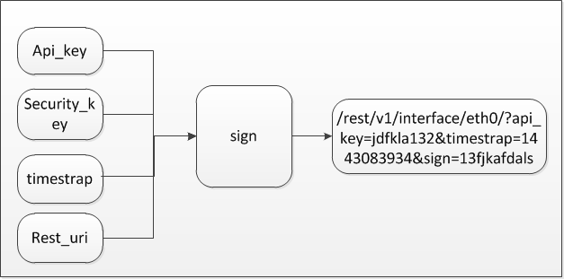
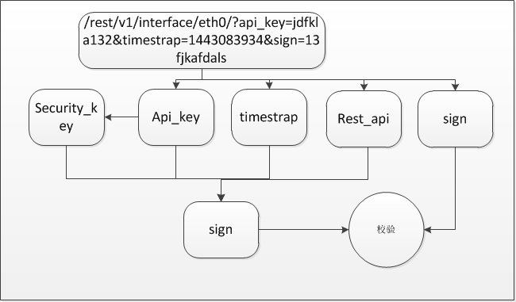
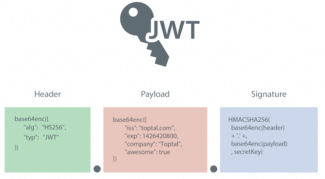
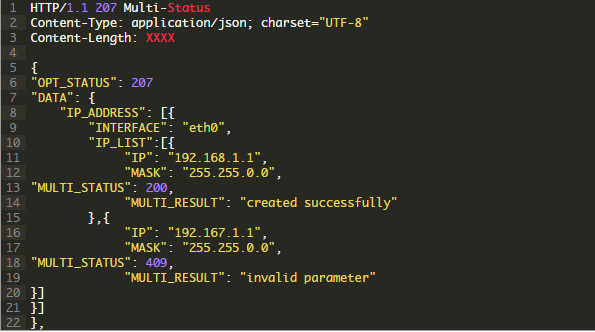

# RESTful api 设计，认证和授权

&emsp;&emsp; REST API 安全设计指南。REST的全称是REpresentational State Transfer，它利用传统Web特点，提出提出一个既适于客户端应用又适于服务端的应用的、统一架构，极大程度上统一及简化了网站架构设计。

&emsp;&emsp; 目前在三种主流的Web服务实现方案中，REST模式服务相比复杂的SOAP和XML-RPC对比来讲，更加简洁，越来越多的web服务开始使用REST设计并实现。但其缺少安全特性，《REST API 安全设计指南》就是一个REST API安全设计的指南，权当抛砖引玉，推荐网站后台设计及网站架构师们阅读。

> 实际应用场景，应该思考的问题：

* restful API 处理请求时的验证和授权流程是怎么样的？

* 传统的web应用，许多东西放到session 里面，如用户信息，用户浏览信息，购物车等等。现在用restful api设计的时候，如何处理这些问题？

* 日志问题，每个API 请求都要记录吗？			
  
  日志其实很有必要啦， 你可以通过框架去配置你的日志，哪些请求可以加日志，哪些不用，这个在调试接口时非常有用，比如支付功能，如果没有日志，真心脑壳痛

* restful API 设计的时候，路由嵌套也就是资源嵌套问题有什么规范吗？

>> 解答：       
 &emsp;&emsp; 我们常见的Web应用做身份认证时，基本上都是基于Http本身的`无状态`的cookie与服务端的session回话机制来处理。 服务端为每一个请求做一次session身份会话（也就是知道你是谁的标签）。
>> REST API设计使用场景可以分两个方面:
>> - 1、为你的WEB应用提供服务 
>>      当为Web应用提供服务时，你可以使用session会话机制处理你的身份验证问题
>
>> - 2、为你的移动应用提供服务(包括第三方)
>>      当为移动应用提供服务时，建议使用Token授权机制，也就是为你的应用颁发一个令牌，这个令牌用来统计应用的访问信息：IP，连接次数，设置授权时间，同时可以管理这些信息，中断其连接
>> 

## 解决方案：
- 认证机制可以采用基于session的认证（内部使用），对外采用basic auth或者oauth

- RESTful API 除了认证，可以为每个API添加用户调用的权限限制，使之更灵活

## 如何设计呢？
 
> 接口地址（URL）统一采用：`http://api.域名/版本/请求资源?过滤参数的格式。`
  例如：http://api.chehubao.com/v1/accounts?limit=10&offset=10。

> 请求参数默认为JSON格式传输，响应内容默认JSON格式返回。
> 
> 客户端需要先进行身份验证，才能与服务端交互。客户端拿到服务端分配的`API_KEY`与`CODE`获取身份标识TOKEN。
>
> 接口服务使用Baisc Auth方式进行授权，除TOKEN接口外，其他接口需要设置HTTP请求头Authorization来设置授权码，用来调用授权的接口。

## 身份认证

> 身份认证包含很多种，有HTTP Basic，HTTP Digest，API KEY，Oauth，JWK等方式，下面简单讲解下：

*  HTTP Basic

REST由于是无状态的传输，所以每一次请求都得带上身份认证信息，身份认证的方式，身份认证的方式有很多种，第一种便是http basic，这种方式在客户端要求简单，在服务端实现也非常简单，只需简单配置apache等web服务器即可实现，所以对于简单的服务来说还是挺方便的。但是这种方式安全性较低，就是简单的将用户名和密码base64编码放到header中。

`base64编码前：Basic admin:admin`

`base64编码后：Basic YWRtaW46YWRtaW4=`

`放到Header中：Authorization: Basic YWRtaW46YWRtaW4= `

正是因为是简单的base64编码存储，切记切记在这种方式下一定得注意使用ssl，不然就是裸奔了。 在某些产品中也是基于这种类似方式，只是没有使用apache的basic机制，而是自己写了认证框架，原理还是一样的，在一次请求中base64解码Authorization字段，再和认证信息做校验。很显然这种方式有问题，认证信息相当于明文传输，另外也没有防暴力破解功能。

*  API KEY

API Key就是经过用户身份认证之后服务端给客户端分配一个API Key，类似：`http://example.com/api?key=dfkaj134`,一般的处理流程如下： 一个简单的设计示例如下： client端：

client端向服务端注册，服务端给客户端发送响应的api_key以及security_key，注意保存不要泄露，然后客户端根据api_key,secrity_key,timestrap,rest_uri采用hmacsha256算法得到一个hash值sign，构造途中的url发送给服务端。 服务端收到该请求后，首先验证api_key,是否存在，存在则获取该api_key的security_key，接着验证timestrap是否超过时间限制，可依据系统成而定，这样就防止了部分重放攻击，途中的rest_api是从url获取的为/rest/v1/interface/eth0,最后计算sign值，完之后和url中的sign值做校验。这样的设计就防止了数据被篡改。 通过这种API Key的设计方式加了时间戳防止了部分重放，加了校验，防止了数据被篡改，同时避免了传输用户名和密码，当然了也会有一定的开销。
*  Oauth1.0a或者Oauth2

OAuth协议适用于为外部应用授权访问本站资源的情况。其中的加密机制与HTTP Digest身份认证相比，安全性更高。使用和配置都比较复杂，这里就不涉及了。

*  JWT

JWT 是JSON Web Token，用于发送可通过数字签名和认证的东西，它包含一个紧凑的，URL安全的JSON对象，服务端可通过解析该值来验证是否有操作权限，是否过期等安全性检查。由于其紧凑的特点，可放在url中或者 HTTP Authorization头中，具体的算法就如下图

## 授权

身份认证之后就是授权，根据不同的身份，授予不同的访问权限。比如admin用户，普通用户，auditor用户都是不同的身份。简单的示例：

	php
	$roles = array(
		'ADMIN'=>array(
		'permit'=>array('/^((\/system\/(clouds|device)$/'), // 允许访问哪些URL的正则表达式
		'deny'=>array('/^(\/system\/audit)$/') // 禁止访问哪些URL的正则表达式
	),
	
	'AUDIT'=>array(
		'permit'=>array('/^(\/system\/audit)$/'),//允许访问的URL正则表达式
		'deny'=>array('/^((\/system\/(clouds|device).*)$/')
	)
	);

上述是垂直权限的处理，如果遇到了平行权限的问题，如用户A获取用户B的身份信息或者更改其他用户信息，对于这些敏感数据接口都需要加上对用户的判断，这一步一般都在具体的逻辑实现中实现。

## URL过滤
在进入逻辑处理之前，加入对URL的参数过滤，如`/site/{num}/policy` 限定num位置为整数等，如果不是参数则直接返回非法参数，设定一个url清单，不在不在url清单中的请求直接拒绝，这样能防止开发中的api泄露。rest api接口一般会用到GET,POST,PUT,DELETE,未实现的方法则直接返回方法不允许，对于POST，PUT方法的数据采用json格式，并且在进入逻辑前验证是否json，不合法返回json格式错误。

## 重要功能加密传输
第一步推荐SSL加密传输，同时对于系统中重要的功能做加密传输，如证书，一些数据，配置的备份功能，同时还得确保具备相应的权限，这一步会在授权中涉及。

## 速率限制
请求速率限制，根据api_key或者用户来判断某段时间的请求次数，将该数据更新到内存数据库（redis，memcached），达到最大数即不接受该用户的请求，同时这样还可以利用到内存数据库key在特定时间自动过期的特性。在php中可以使用APC，Alternative PHP Cache (APC) 是一个开放自由的PHP opcode 缓存。它的目标是提供一个自由、 开放，和健全的框架用于缓存和优化PHP的中间代码。在返回时设置X-Rate-Limit-Reset:当前时间段剩余秒数，APC的示例代码如下： 

	php
	
	Route::filter('api.limit', function(){
		$key = sprintf('api:%s', Auth::user()->api_key);// Create the key if it doesn't exist
		Cache::add($key, 0, 60);// Increment by 1
		$count = Cache::increment($key);// Fail if hourly requests exceeded
		if ($count > Config::get('api.requests_per_hour')){
			App::abort(403, 'Hourly request limit exceeded');
		}
	});

## 错误处理
对于非法的，导致系统出错的等请求都进行记录，一些重要的操作，如登录，注册等都通过日志接口输出展示。有一个统一的出错接口，对于400系列和500系列的错误都有相应的错误码和相关消息提示，如401：未授权；403：已经鉴权，但是没有相应权限。如不识别的url:{"result":"Invalid URL!"},错误的请求参数{"result":"json format error"},不允许的方法：{"result":"Method Not Allowed"}，非法参数等。上面所说的都是单状态码，同时还有多状态码，表示部分成功，部分字符非法等。示例如下：

## 重要ID不透明处理
在系统一些敏感功能上，比如/user/1123 可获取id=1123用户的信息，为了防止字典遍历攻击，可对id进行url62或者uuid处理，这样处理的id是唯一的，并且还是字符安全的。

## 其他注意事项
（1）请求数据，对于POST,DELETE方法中的数据都采用json格式，当然不是说rest架构不支持xml，由于xml太不好解析，对于大部分的应用json已经足够，近一些的趋势也是json越来越流行，并且json格式也不会有xml的一些安全问题，如xxe。使用json格式目前能防止扫描器自动扫描。 		
（2）返回数据统一编码格式，统一返回类型，如Content-Type: application/json; charset=”UTF-8″ 		
（3）在逻辑实现中，json解码之后进行参数验证或者转义操作，第一步json格式验证，第二步具体参数验证基本上能防止大部分的注入问题了。 			
（4）在传输过程中，采用SSL保证传输安全。 （5）存储安全，重要信息加密存储，如认证信息hash保存。

总之，尽量使用SSL。

[参考：http://blog.nsfocus.net/rest-api-design-safety/](http://blog.nsfocus.net/rest-api-design-safety/)