# Chrome调试工具的使用

常用的面板

* Elements(元素面板)  

   &emsp;&emsp;Elements: 允许我们从浏览器的角度看页面，也就是说我们可以看到chrome渲染页面所需要的的HTML、CSS和DOM(Document Object Model)对象。此外，还可以编辑这些内容更改页面显示效果；

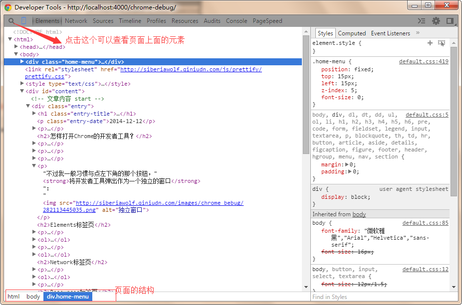
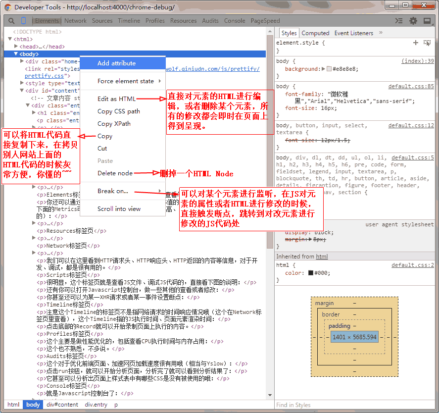
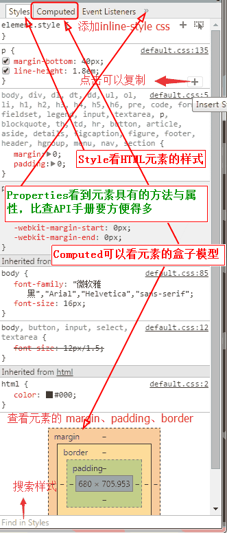

* Console(控制台面板)  

  &emsp;&emsp; Console: 显示各种警告与错误信息，并且提供了shell用来和文档、开发者工具交互。
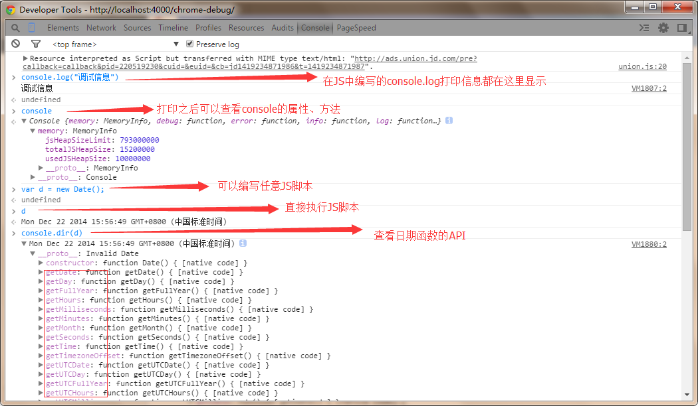
  
* Sources(资源面板)  
  
  &emsp;&emsp; Sources: 主要用来调试js；
  
* NetWork(网络面板)
   
   &emsp;&emsp;Network: 可以看到页面向服务器请求了哪些资源、资源的大小以及加载资源花费的时间，当然也能看到哪些资源不能成功加载。此外，还可以查看HTTP的请求头，返回内容等；  

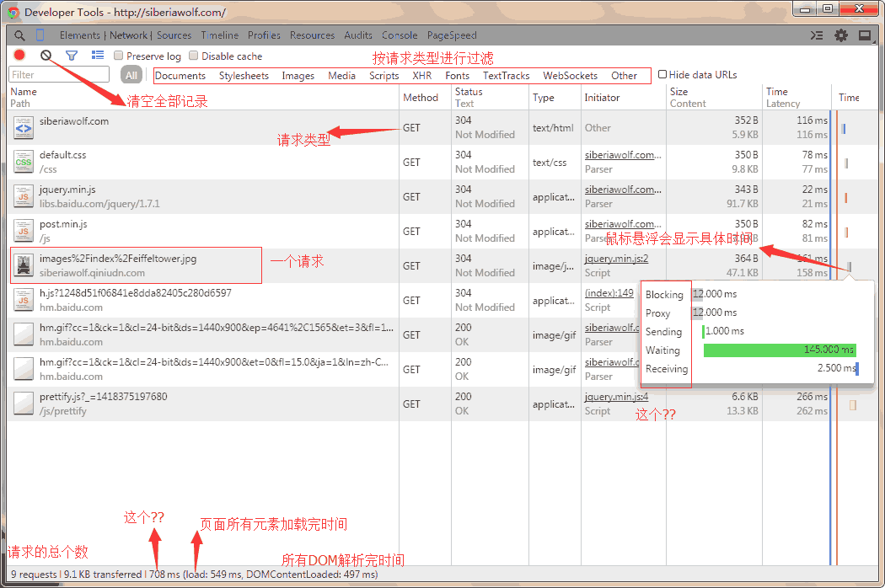 
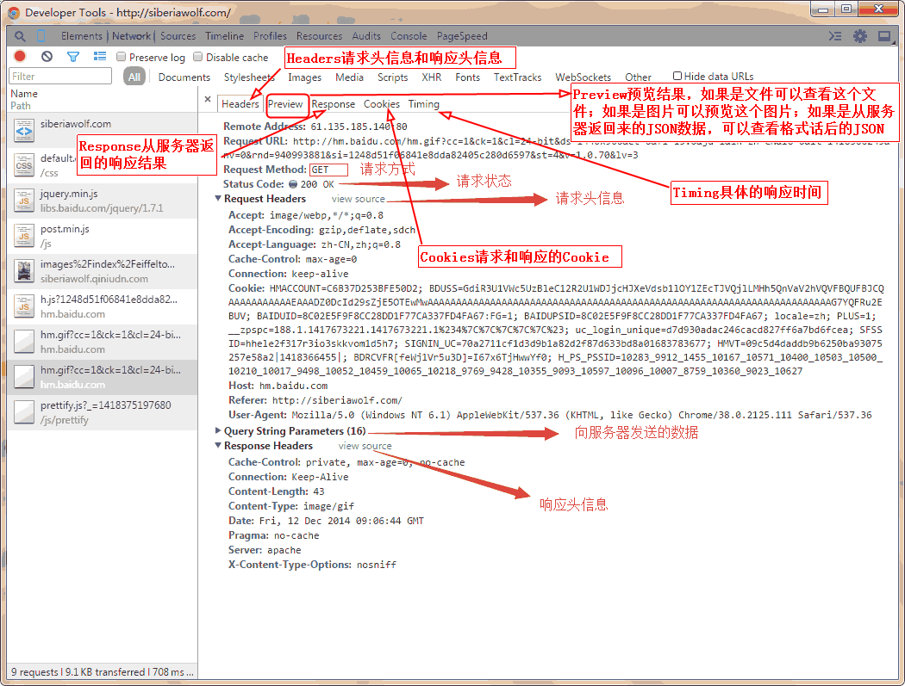 
 
* Timeline
  
   &emsp;&emsp;Network:Timeline: 提供了加载页面时花费时间的完整分析，所有事件，从下载资源到处理Javascript，计算CSS样式等花费的时间都展示在Timeline中； 

   注意这个Timeline的标签页不是指网络请求的时间响应情况，这个Timeline指的JS执行时间、页面元素渲染时间（每个信息都怎么看，我没弄懂..）
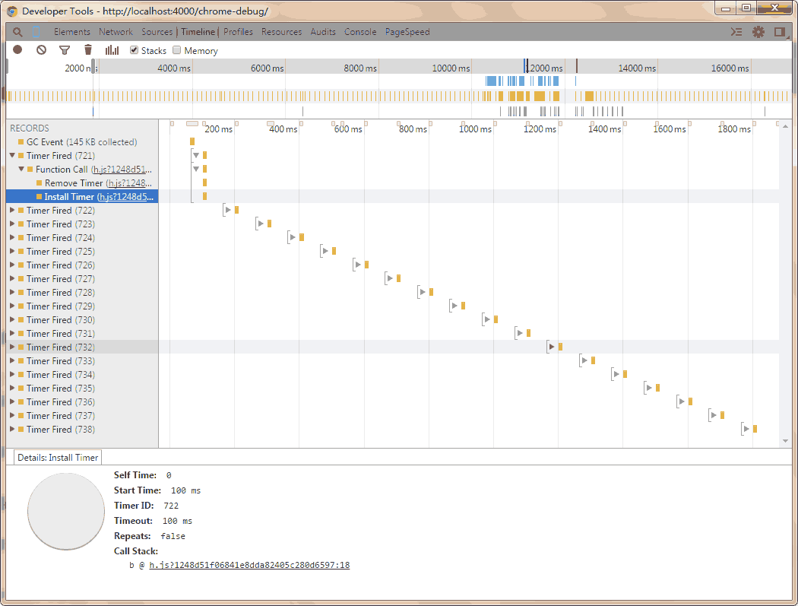

* Profiles

   &emsp;&emsp;Profiles: 分析web应用或者页面的执行时间以及内存使用情况；主要是做性能优化的，包括查看CPU执行时间与内存占用.
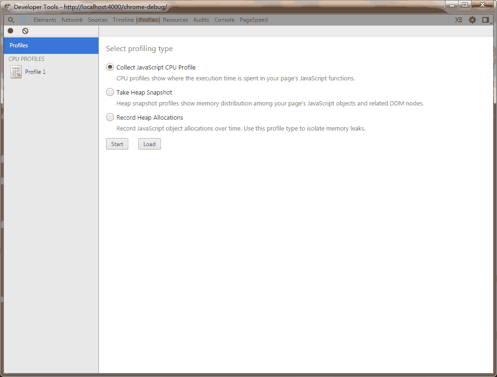

* Resources

   &emsp;&emsp;Resources: 对本地缓存（IndexedDB、Web SQL、Cookie、应用程序缓存、Web Storage）中的数据进行确认及编辑；

   Resources标签页可以查看到请求的资源情况，包括CSS、JS、图片等的内容。也可以设置各种断点。对存储的内容进行编辑然后保存也会实时的反应到页面上。
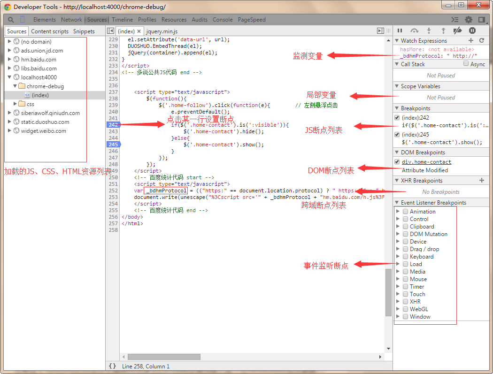
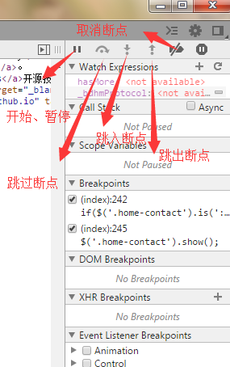

 
* Audits
  &emsp;&emsp; Audits: 分析页面加载的过程，进而提供减少页面加载时间、提升响应速度的方案；这个对于优化前端页面、加速网页加载速度很有用哦（相当与Yslow）

点击run按钮，就可以开始分析页面，分析完了就可以看到分析结果了
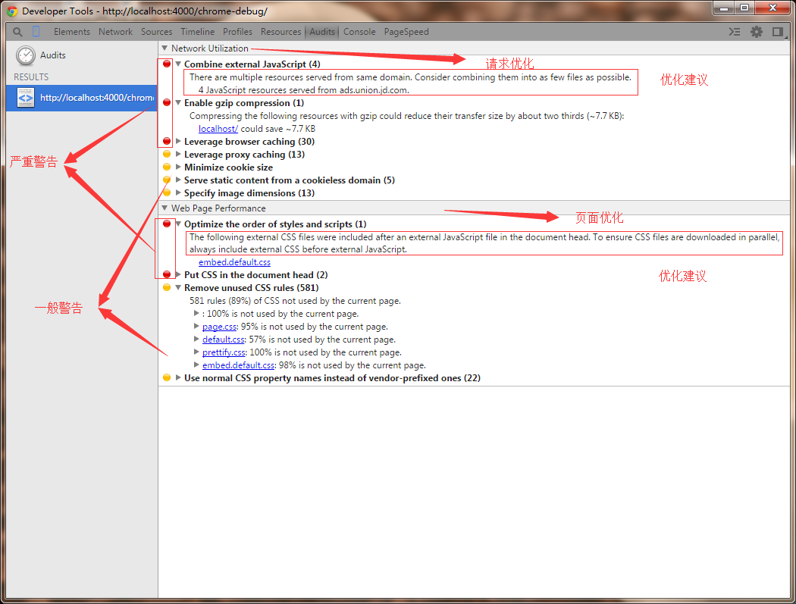

## 移动端开发调试
现在新版chrome弹出控制台后如下图，其中的工具对移动端调试非常方便。
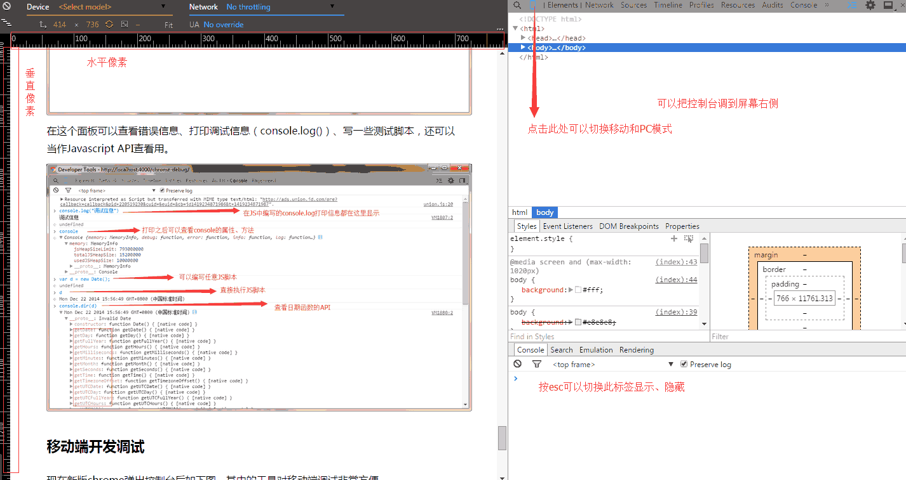

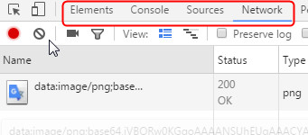

##1、Elements panel

定义：通过Elements 面板，不仅仅可以查看和编辑页面和样式，而且所做的改变立即生效。    
 Elements工具像一把手术刀一样“解剖”了当前页面。 

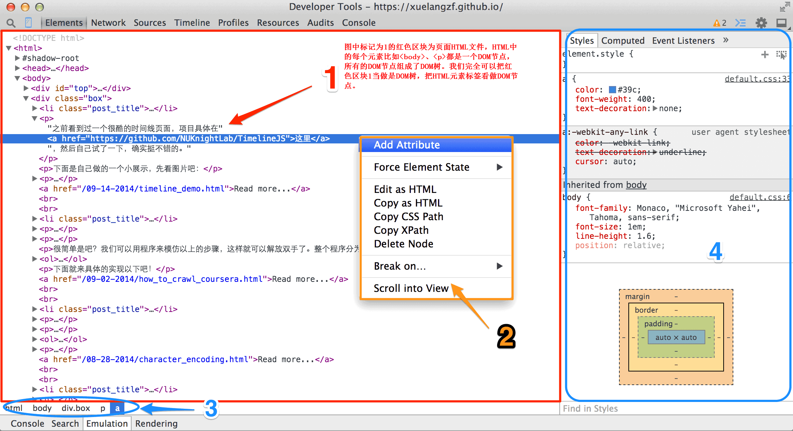

>选中DOM对象之后右键即可以看到一些辅助的功能，如图中标记为2的区块所示：
>> 1、Add Attribute: 在标签中增加新的属性；   
>> 2、Force Element State: 有时候我们为页面元素添加一些动态的样式，比如当鼠标悬停在元素上时的样式，这种动态样式很难调试。我们可以使用Force Element State强制元素状态，便于调试，如下图：   
![图4. 强制元素状态][4]    
>> 3、Edit as HTML: 以HTML形式更改页面元素；    
>> 4、Copy XPath: 复制XPath；    
>> 5、Delete Node: 删除DOM节点；   
>> 6、Break On: 设置DOM 断点。    
  
> 图中被标记为3的蓝色区块显示当前标签的路径：从html开始一直到当前位置，我们单击路径中任何一个标签，即可以跳转到相应标签内容中去。  
> 图中标记为4的蓝色区块实时显示当前选中标签的CSS样式、属性等，一共有以下5小部分：    
>> 1、Styles: 显示用户定义的样式，比如请求的default.css中的样式，和通过Javasript生成的样式，还有开发者工具添加的样式；    
>> 2、Computed: 显示开发者工具计算好的元素样式；    
>> 3、Event Listeners: 显示当前HTML DOM节点和其祖先节点的所有JavaScript事件监听器，这里的监听脚本可以来自Chrome的插件。可以点击右边小漏斗形状(filter)选择只显示当前节点的事件监听器。   
>> 4、DOM Breakpoints: 列出所有的DOM 断点；    
>> 5、Properties: 超级全面地列出当前选中内容的属性，不过基本很少用到。  
 
实际应用中我们经常会用到Styles，如下图：   
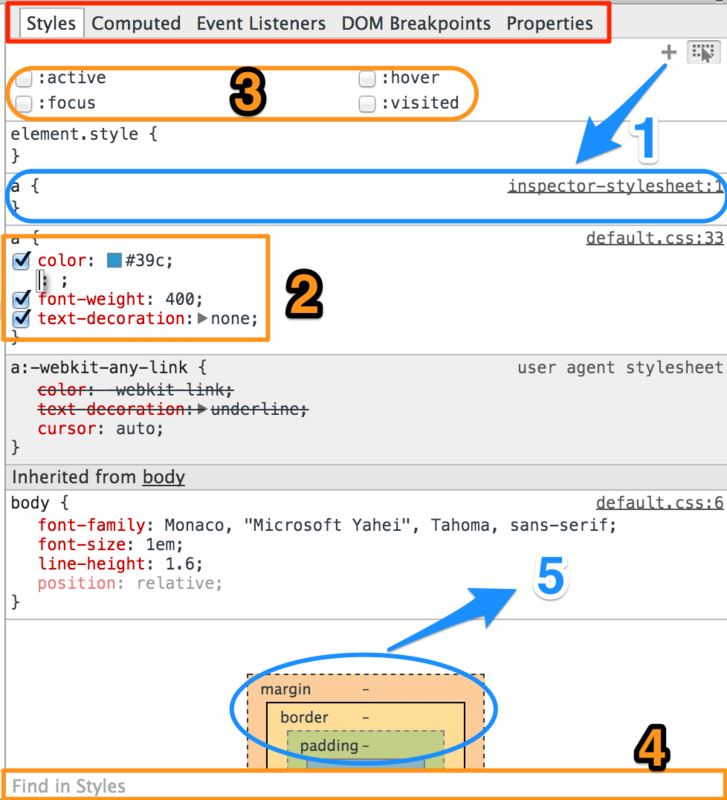

图中标记为1的+号为New style rule，可以为当前标签添加新的选择器，新建立的样式为inspector-stylesheet。此外，也可以直接在原有的样式上增加、修改、禁用样式属性，如图中标记2显示。

在New style rule右边为Toggle Element State，选择后会出现标记3显示的选择框，如果选中:hover后，即可以看到鼠标悬停在页面元素上时的CSS样式了，作用类似于前面的Force Element Satte，更多内容可以看:hover state in Chrome Developer Tools 。

更强大的是，开发者工具以直观的图形展示了盒子模型的margin、border、padding部分，如标记5所示。下面动态图给出了盒子模型的一个示例：
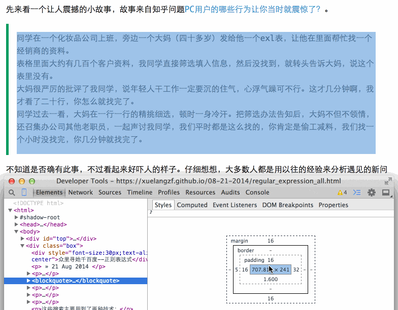

操作DOM

1、查看DOM树：打开Element面板，可以查看所有DOM节点，包括CSS和JavaScript，一般左侧查看DOM树，右侧查看CSS样式。
2、选区DOM节点：将鼠标移到网页中的某元素上面，可以选中DOM节点
3、增加、删除和修改DOM节点：在Element面板中，选择DOM节点，在文本处右击鼠标，会弹出一个菜单，
4、为节点添加属性，查看盒模型
5、查看CSS样式，如更改CSS属性，动态变化

> 拖拽节点, 调整顺序;或拖拽节点到编辑器；ctrl + z 撤销修改

> 查看元素上绑定了哪些事件

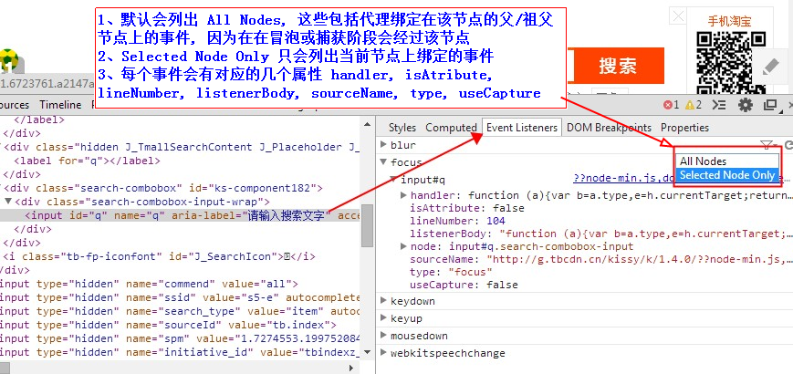

> 技巧：在CSS样式的属性值上，如果是数字的属性值，则可以通过按上下方向快捷键来给属性值加一，通过按住shift键的同时按上下方向快捷键，可以给属性值递增十

	Element 译为“元素”，Element 面板可以让我们动态查看和编辑DOM节点和CSS样式表，并且立即生效，
	避免了频繁切换浏览器和编辑器的麻烦。 我们可以使用Element面板来查看源代码，它不但可以很好的格
    式化DOM节点，清晰的展现HTML文档，比在当前网页中右击鼠标选择“查看网页源代码”强大很多。 总之，
    Element面板可以让我们很透彻的了解DOM和CSS的底层结构。

  在查看某些伪类的属性，如:hover时，无法查看到具体的样式，查阅了一些资料，是通过鼠标Hover在元素上，然后右键检查，或者在面板选择上:hover。

## 2. Console panel

定义：使用Console API向控制台输出信息，产生JavaScript文件和启动调试会话

用途：   
 1、console.log(messgae)，用于调试JS，查看错误等。      
 2、直接运行JS代码

#### console.log() VS console.info() VS console.error()  VS console.warn()

## 3. Network panel

查看HTTP请求，查看cookie，AJAX请求等信息，例如，给按钮绑定点击事件，可以通过网络面板，来查看请求是否成功发出，和接收到的信息。

有时候我们的网页加载的很慢，而相同网速下，其他网页加载速度并不慢。这时候就得考虑优化网页，优化前我们必须知道加载速度的瓶颈在哪里，这个时候可以考虑使用Network工具。下图为我的博客首页加载时的Network情况：

**请求的每个资源在Network表格中显示为一行，每个资源都有许多列的内容(如红色区块1)，不过默认情况下不是所有列都显示出来。**

- Name/Path: 资源名称以及URL路径；
- Method: HTTP请求方法；
- Status/Text: HTTP状态码/文字解释；
- Type: 请求资源的MIME类型；
- Initiator解释请求是怎么发起的，有四种可能的值：
 - Parser：请求是由页面的HTML解析时发送的；
 - Redirect：请求是由页面重定向发送的；
 - Script：请求是由script脚本处理发送的；
 - Other：请求是由其他过程发送的，比如页面里的link链接点击，在地址栏输入URL地址。
- Size/Content: Size是响应头部和响应体结合起来的大小，Content是请求内容解码后的大小。进一步了解可以看这里Chrome Dev Tools - “Size” vs “Content”；
- Time/Latency: Time是从请求开始到接收到最后一个字节的总时长，Latency是从请求开始到接收到第一个字节的时间；
- Timeline: 显示网络请求的可视化瀑布流，鼠标悬停在某一个时间线上，可以显示整个请求各部分花费的时间。
以上是默认显示的列，不过我们可以在瀑布流的顶部右键，这样就可以选择显示或者隐藏更多的列，比如Cache-Control, Connection, Cookies, Domain等。

我们可以按照上面任意一项来给资源请求排序，只需要单击相应的名字即可。Timeline排序比较复杂，单击Timeline后，需要选择根据Start Time、Response Time、End Time、Duration、Latency中的一项来排序。

**红色区块2中，一共有6个小功能：**

- 1、Record Network Log: 红色表示此时正在记录资源请求信息；
- 2、Clear: 清空所有的资源请求信息；
- 3、Filter: 过滤资源请求信息；
- 4、Use small resource raws: 每一行显示更少的内容；
- 5、Perserve Log: 再次记录请求的信息时不擦出之前的资源信息；
- 6、Disable cache: 不允许缓存的话，所有资源均重新加载。

选择Filter后，就会出现如红色区块3所显示的过滤条件，当我们点击某一内容类型(可以是Documents, Stylesheets, Images, Scripts, XHR, Fonts, WebSockets, Other)后，只显示该特定类型的资源。在XHR请求中，可以在一个请求上右键选择“Replay XHR”来重新运行一个XHR请求。

有时候我们需要把Network里面内容传给别人，这时候可以在资源请求行的空白处右键然后选择Save as HAR with Content保存为一个HAR文件。然后可以在一些第三方工具网站，比如这里重现网络请求信息。

选定某一资源后，我们还可以Copy as cURL，也就是复制网络请求作为curl命令的参数，详细内容看 [Copying requests as cURL commands](https://developer.chrome.com/devtools/docs/network#copying-requests-as-curl-commands)

此外，我们还可以查看网络请求的请求头，响应头，已经返回的内容等信息，如下图：
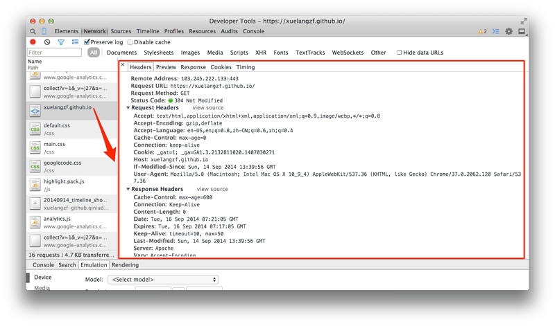

**资源的详细内容有以下几个：**

> HTTP request and response headers    
> Resource preview: 可行时进行资源预览；    
> HTTP response: 未处理过的资源内容；    
> Cookie names and values: HTTP请求以及返回中传输的所有Cookies；    
> WebSocket messages: 通过WebSocket发送和接收到的信息；   
> Resource network timing: 图形化显示资源加载过程中各阶段花费的时间。   

## 4. Sources panel

  