# 彻底弄懂flex布局

**技术前瞻：**

+ 容器属性
    + flex-flow
    + flex-direction
    + flex-wrap
    + justify-content
    + align-items
    + align-content

+ 元素属性
    + order
    + flex-grow
    + flex-shrink
    + flex-basis
    + flex
    + align-self

## 1、flex弹性盒子模型

对于某个元素只要声明了display: flex;，那么这个元素就成为了弹性容器，具有flex弹性布局的特性。

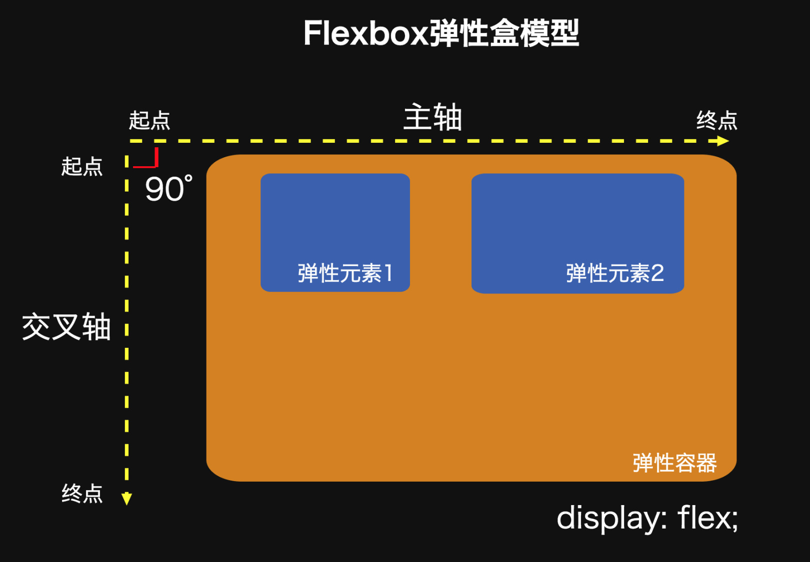

1) 每个弹性容器都有两根轴：**主轴和交叉轴**，两轴之间成90度关系。注意：水平的不一定就是主轴。
2) 每根轴都**起点和终点**，这对于元素的对齐非常重要。 
3) 弹性容器中的所有子元素称为`<弹性元素>`，弹性元素永远沿主轴排列。
4) 弹性元素也可以通过display:flex设置为另一个弹性容器，形成嵌套关系。因此**一个元素既可以是弹性容器也可以是弹性元素**。

弹性容器的两根轴非常重要，所有属性都是作用于轴的。

## 2、主轴

flex布局是一种一**维布局**模型，一次只能处理一个维度（一行或者一列）上的元素布局，作为对比的是二维布局[CSS Grid Layout](https://developer.mozilla.org/en-US/docs/Web/CSS/CSS_Grid_Layout)，可以同时处理行和列上的布局。

也就是说，**flex布局大部分的属性都是作用于主轴的，在交叉轴上很多时候只能被动地变化**。

1) 主轴的方向

我们可以在弹性容器上通过`flex-direction`修改主轴的方向。如果主轴方向修改了，那么：

+ 1、交叉轴就会相应地旋转90度。
+ 2、弹性元素的排列方式也会发生改变，因为**弹性元素永远沿主轴排列**。

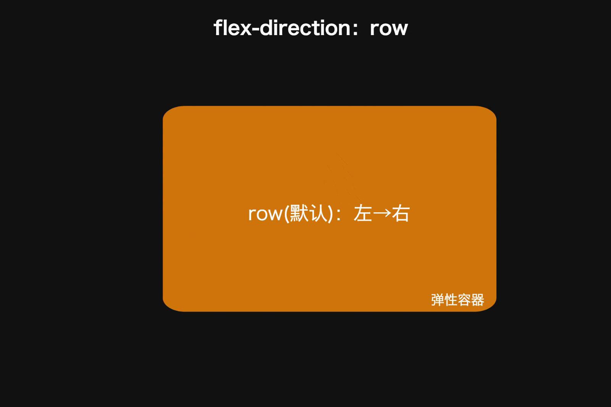

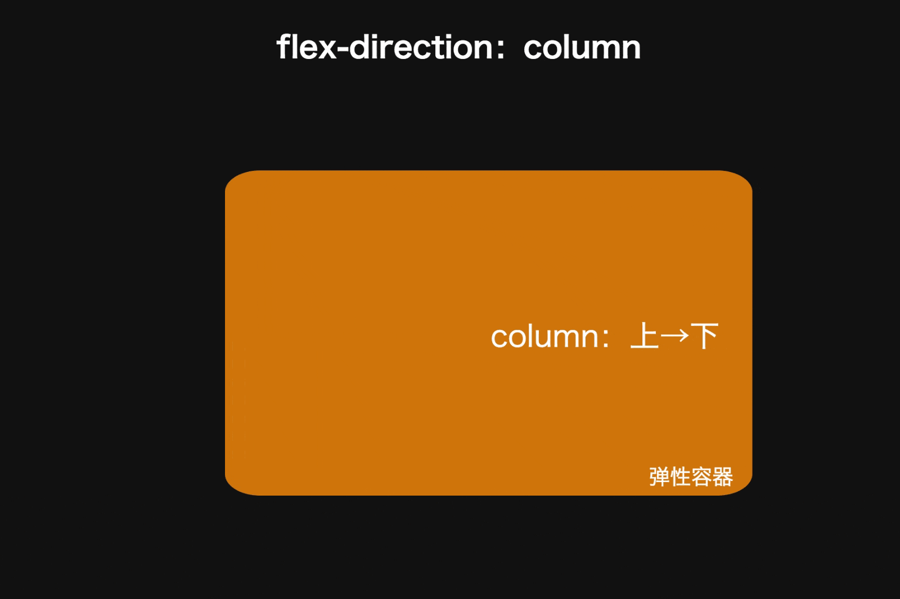

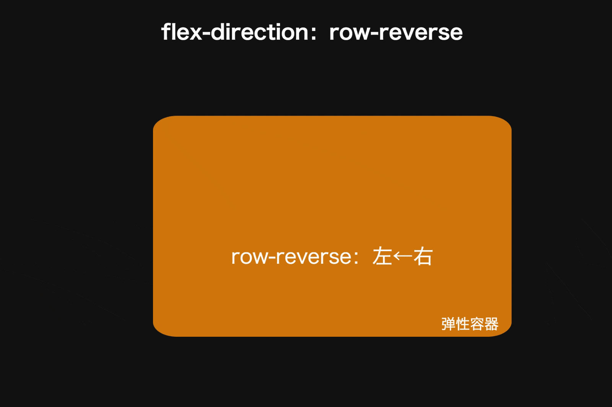

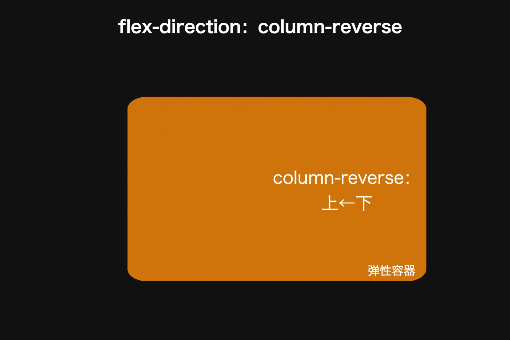

2) 沿主轴的排列处理

弹性元素永远沿主轴排列，那么如果主轴排不下，该如何处理？

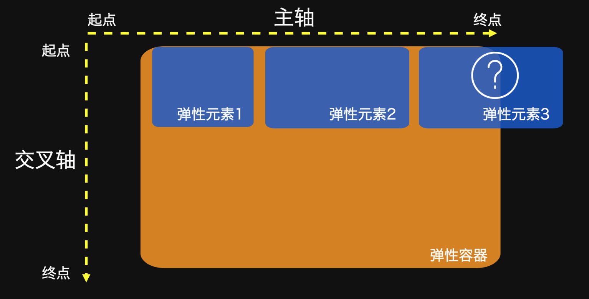

通过设置`flex-wrap: nowrap | wrap | wrap-reverse`可使得主轴上的元素不折行、折行、反向折行。

**默认是nowrap不折行**，难道任由元素直接溢出容器吗？当然不会，那么这里就涉及到元素的弹性伸缩应对.

`wrap折行`，顾名思义就是另起一行，那么折行之后行与行之间的间距（对齐）怎样调整？这里又涉及到交叉轴上的多行对齐。
`wrap-reverse`反向折行，是从容器底部开始的折行，但每行元素之间的排列仍保留正向。

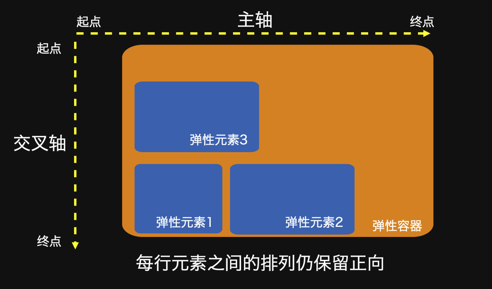

3) 一个复合属性

`flex-flow = flex-drection + flex-wrap`

`flex-flow`相当于规定了flex布局的“工作流(flow)”

`flex-flow: row nowrap;`

## 3、元素如何弹性伸缩应对

当`flex-wrap: nowrap;`不折行时，容器宽度有剩余/不够分，弹性元素们该怎么“弹性”地伸缩应对？

这里针对上面两种场景，引入两个属性(需应用在弹性元素上)

+ 1、`flex-shrink`：缩小比例（容器宽度<元素总宽度时如何收缩）
+ 2、`flex-grow`：放大比例（容器宽度>元素总宽度时如何伸展）

### flex-shrink: 缩小比例

来看下以下场景，弹性容器#container宽度是200px，一共有三个弹性元素，宽度分别是50px、100px、120px。在不折行的情况下，此时容器宽度是明显不够分配的。

实际上，flex-shrink默认为1，也就是当不够分配时，元素都将等比例缩小，占满整个宽度，如下图。

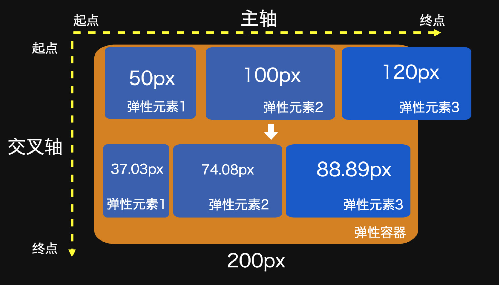

```css
#container {
  display: flex;
  flex-wrap: nowrap;
}
```

**小结：`flex-shrink: 1`并非严格等比缩小，它还会考虑弹性元素本身的大小。**

### flex-grow: 放大比例

同样，弹性容器#container宽度是200px，但此时只有两个弹性元素，宽度分别是50px、100px。此时容器宽度是有剩余的。

那么剩余的宽度该怎样分配？而flex-grow则决定了要不要分配以及各个分配多少。

（1）在flex布局中，容器剩余宽度默认是不进行分配的，也就是所有弹性元素的flex-grow都为0。

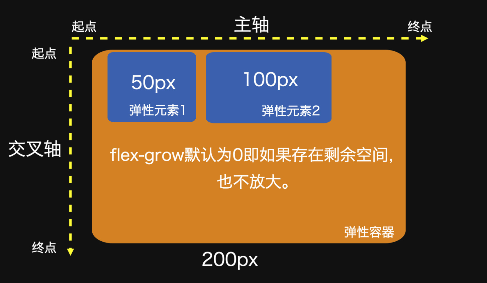

（2）通过指定flex-grow为大于零的值，实现容器剩余宽度的分配比例设置。

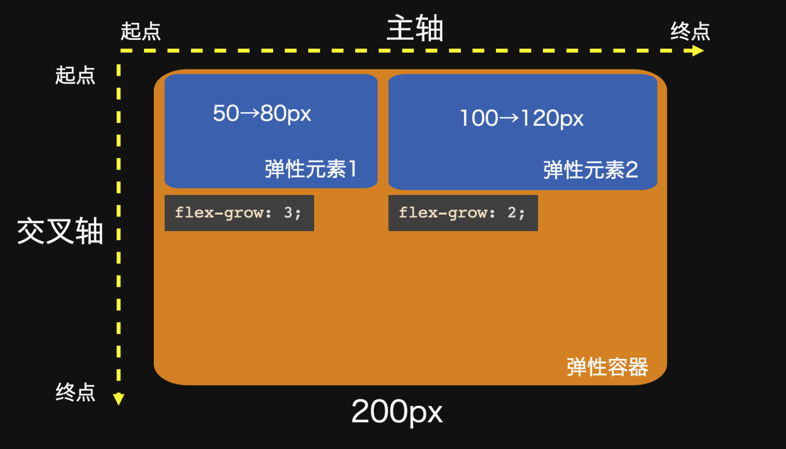

## 4、弹性处理与刚性尺寸

在进行弹性处理之余，其实有些场景我们更希望元素尺寸固定，不需要进行弹性调整。设置元素尺寸除了`width`和`height`以外，flex还提供了一个`flex-basis`属性。

`flex-basis`设置的是元素在主轴上的初始尺寸，所谓的初始尺寸就是元素在`flex-grow`和`flex-shrink`生效前的尺寸。

### 与width/height的区别

首先以width为例进行比较。看下下面的例子。`#container {display:flex;}`。

(1) 两者都为0

```html
<div id="container">
  <div>11111</div>
  <div>22222</div>
</div>
```

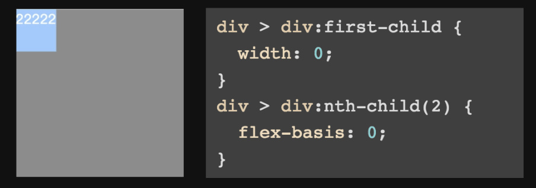

**width: 0 —— 完全没显示**

**flex-basis: 0 —— 根据内容撑开宽度**

(2) 两者非0

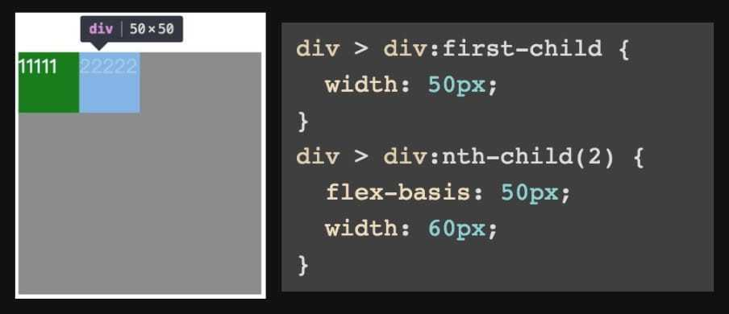

**width: 非0;**

**flex-basis: 非0**

小结：
 
 —— 数值相同时两者等效

 —— 同时设置，flex-basis优先级高


(3) flex-basis为auto

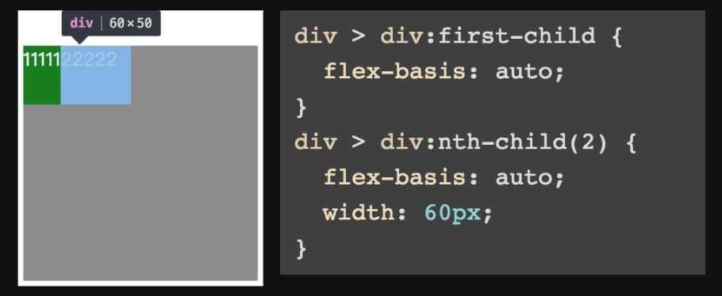

flex-basis为auto时，如设置了width则元素尺寸由width决定；没有设置则由内容决定

(4) flex-basis == 主轴上的尺寸 != width


将主轴方向改为：上→下

此时主轴上的尺寸是元素的height

flex-basis == height

### 常用的复合属性 flex

这个属性应该是最容易迷糊的一个，下面揭开它的真面目。

`flex = flex-grow + flex-shrink + flex-basis`

复合属性，前面说的三个属性的简写。


```
一些简写
flex: 1 = flex: 1 1 0%
flex: 2 = flex: 2 1 0%
flex: auto = flex: 1 1 auto;
flex: none = flex: 0 0 auto; // 常用于固定尺寸 不伸缩
```

**flex:1 和 flex:auto 的区别**

其实可以归结于flex-basis:0和flex-basis:auto的区别。

flex-basis是指定初始尺寸，当设置为0时（绝对弹性元素），此时相当于告诉flex-grow和flex-shrink在伸缩的时候不需要考虑我的尺寸；相反当设置为auto时（相对弹性元素），此时则需要在伸缩时将元素尺寸纳入考虑。

因此从下图（转自W3C）可以看到绝对弹性元素如果flex-grow值是一样的话，那么他们的尺寸一定是一样的。

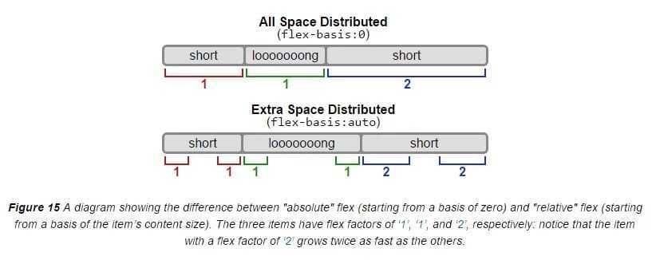


## 5、容器内如何对齐

### 1. 主轴上的对齐方式 (利用 justify-content)

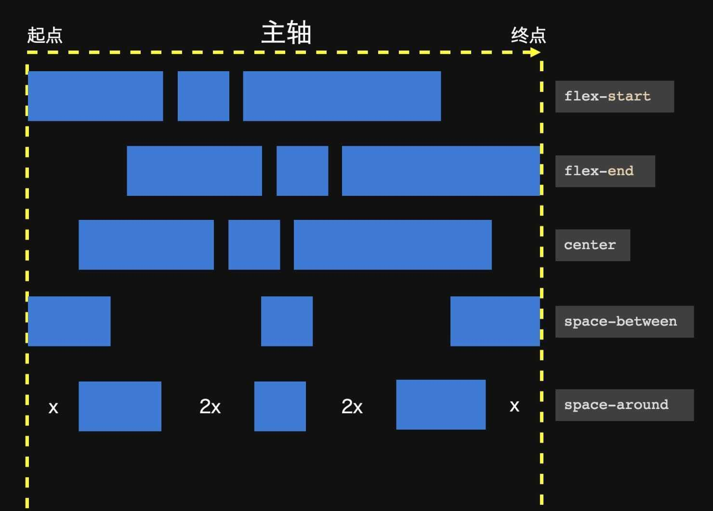

### 2. 交叉轴上的对齐方式

主轴上比较好理解，重点是交叉轴上。因为交叉轴上存在单行和多行两种情况。

**交叉轴上的单行对齐**

align-items

默认值是stretch，当元素没有设置具体尺寸时会将容器在交叉轴方向撑满。

当align-items不为stretch时，此时除了对齐方式会改变之外，元素在交叉轴方向上的尺寸将由内容或自身尺寸（宽高）决定

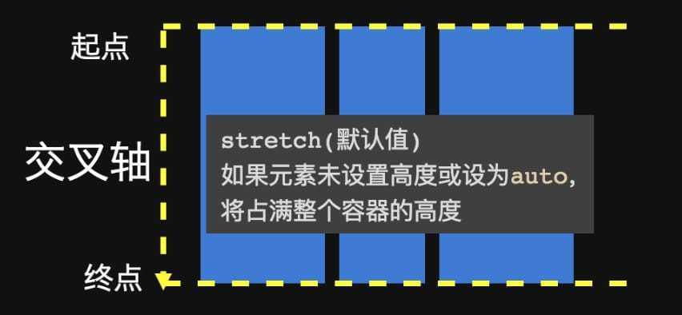
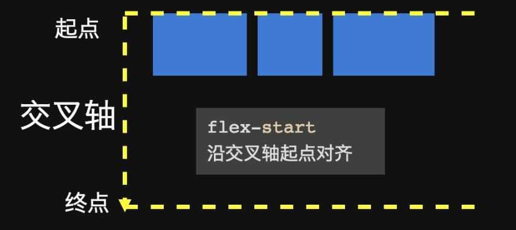
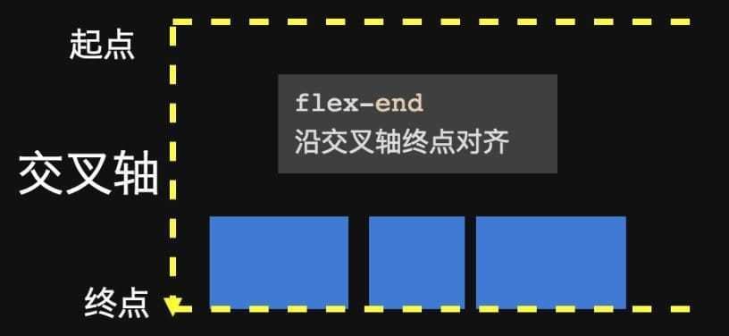
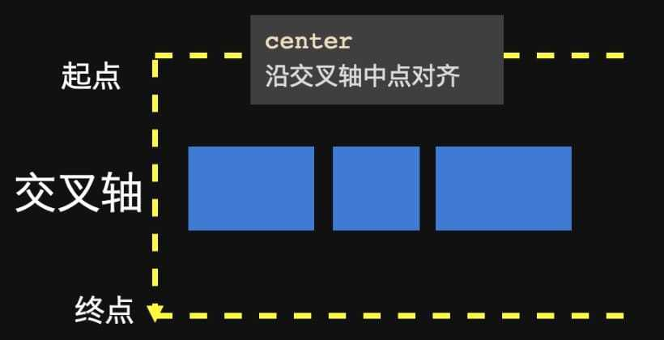
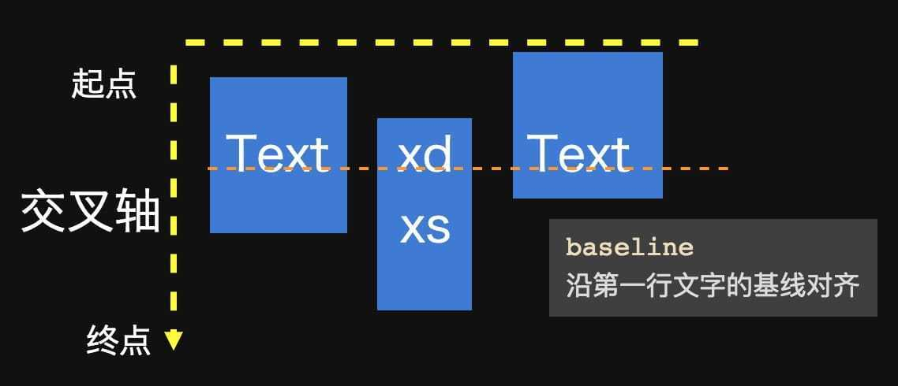

注意，交叉轴不一定是从上往下，这点再次强调也不为过。

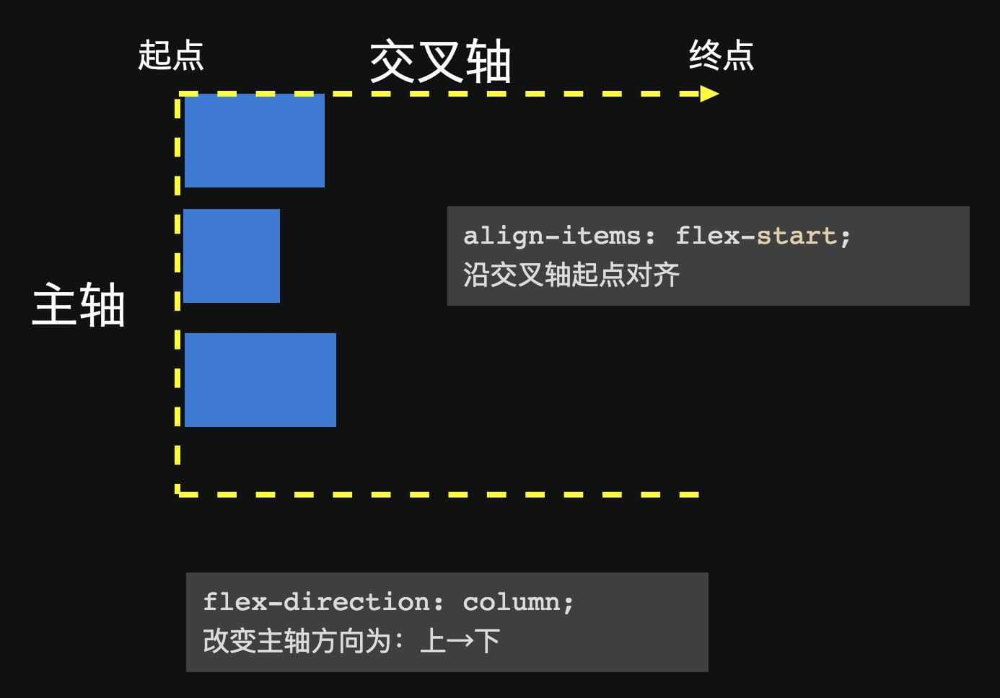

**交叉轴上的多行对齐**

还记得可以通过flex-wrap: wrap使得元素在一行放不下时进行换行。在这种场景下就会在交叉轴上出现多行，多行情况下，flex布局提供了align-content属性设置对齐。

align-content与align-items比较类似，同时也比较容易迷糊。下面会将两者对比着来看它们的异同。

首先明确一点：align-content只对多行元素有效，**会以多行作为整体进行对齐**，容器必须开启换行。

```
align-content: stretch | flex-start | flex-end | center | space-between | space-around

align-items: stretch | flex-start | flex-end | center | baseline
```

在属性值上，align-content比align-items多了两个值：space-between和space-around。

**align-content与align-items异同对比**

与align-items一样，align-content:默认值也是stretch。两者同时都为stretch时，毫无悬念所有元素都是撑满交叉轴。

```css
#container {
  align-items: stretch;
  align-content: stretch;
}
```

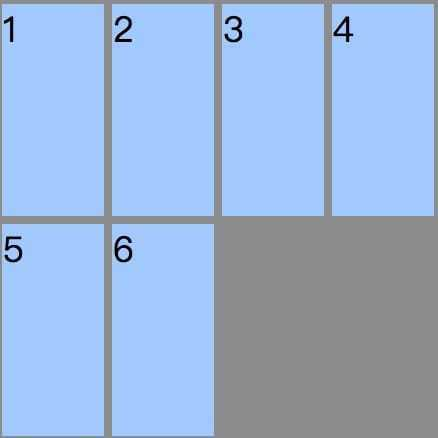

当我们将align-items改为flex-start或者给弹性元素设置一个具体高度，此时效果是行与行之间形成了间距。

```css
#container {
  align-items: flex-start;
  align-content: stretch;
}

/*或者*/
#container {
  align-content: stretch;
}
#container > div {
  height: 30px;
}
```

为什么？因为align-content会以整行为单位，此时会将整行进行拉伸占满交叉轴；而align-items设置了高度或者顶对齐，在不能用高度进行拉伸的情况下，选择了用间距。

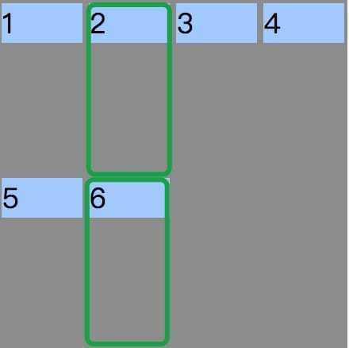

尝试把align-content设置为顶对齐，此时以行为单位，整体高度通过内容撑开。

而align-items仅仅管一行，因此在只有第一个元素设置了高度的情况下，第一行的其他元素遵循align-items: stretch也被拉伸到了50px。而第二行则保持高度不变。

```css
#container {
  align-items: stretch;
  align-content: flex-start;
}
#container > div:first-child {
    height: 50px;
}
```
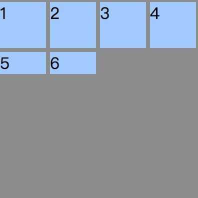

两者的区别还是不明显？来看下面这个例子。

这里仅对第二个元素的高度进行设置，其他元素高度则仍保持内容撑开。

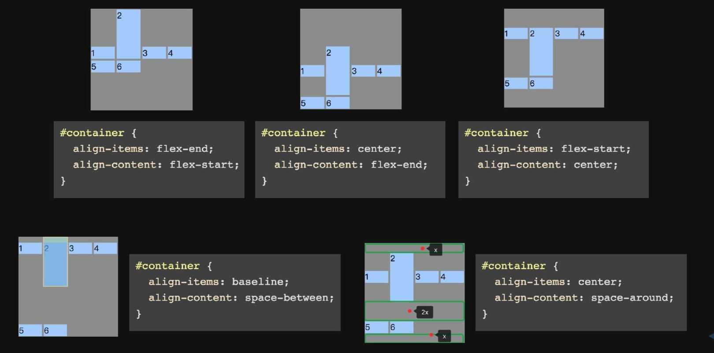

以第一个图为例，会发现align-content会将所有行进行顶对齐，然后第一行由于第二个元素设置了较高的高度，因此体现出了底对齐。

两者差异总结：

+ 两者“作用域”不同
+ align-content管全局(所有行视为整体)
+ align-items管单行

**能否更灵活地设置交叉轴对齐**
除了在容器上设置交叉轴对齐，还可以通过align-self单独对某个元素设置交叉轴对齐方式。

1) 值与`align-items`相同
2) 可覆盖容器的`align-items`属性
3) 默认值为`auto`，表示继承父元素的`align-items`属性

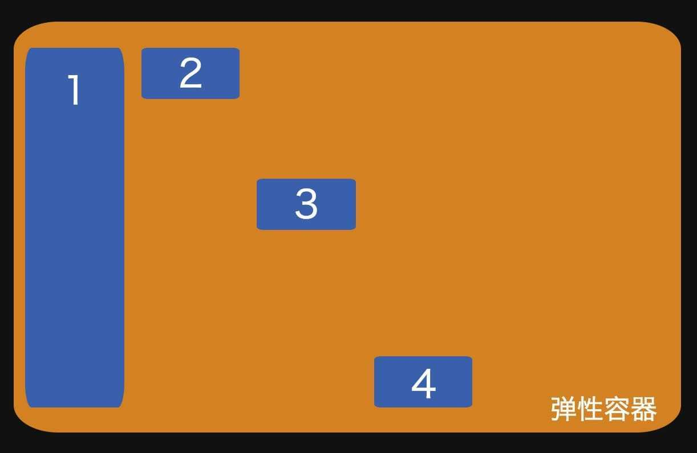

```css
#container {
  display: flex;
  align-items: flex-start;
}

#container > div:first-child {
  align-self: stretch;
}

#container > div:nth-child(3) {
  align-self: center;
}

#container > div:nth-child(4) {
  align-self: flex-end;
}
```

## 6、其他

### order：更优雅地调整元素顺序

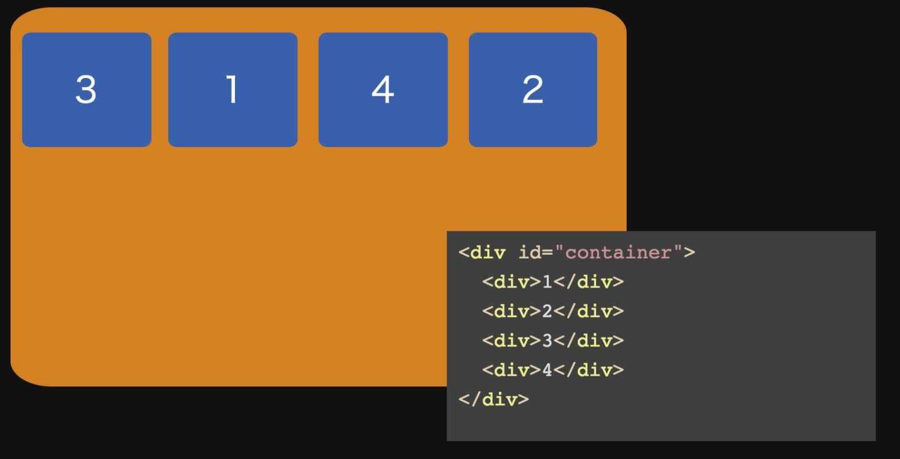

```css
#container > div:first-child {
  order: 2;
}
#container > div:nth-child(2) {
  order: 4;
}
#container > div:nth-child(3) {
  order: 1;
}
#container > div:nth-child(4) {
  order: 3;
}
```
**order：可设置元素之间的排列顺序**

+ 1、数值越小，越靠前，默认为0
+ 2、值相同时，以dom中元素排列为准

## 总结

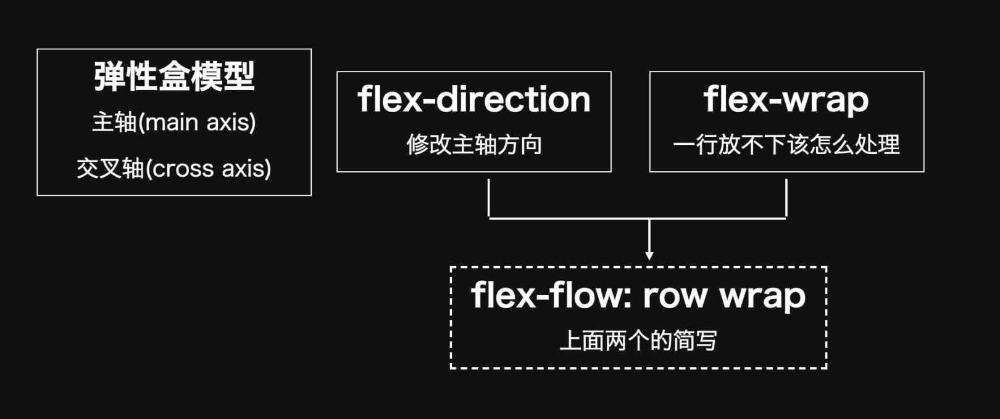
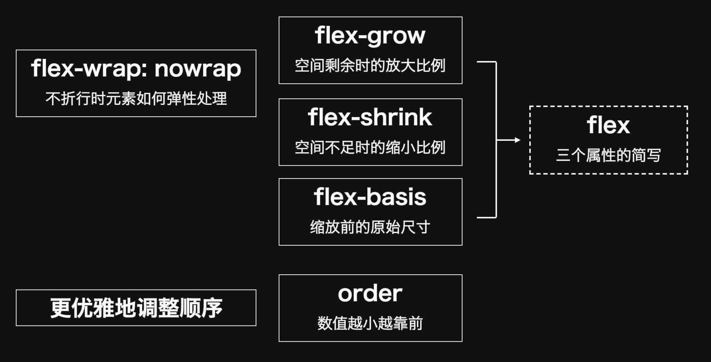
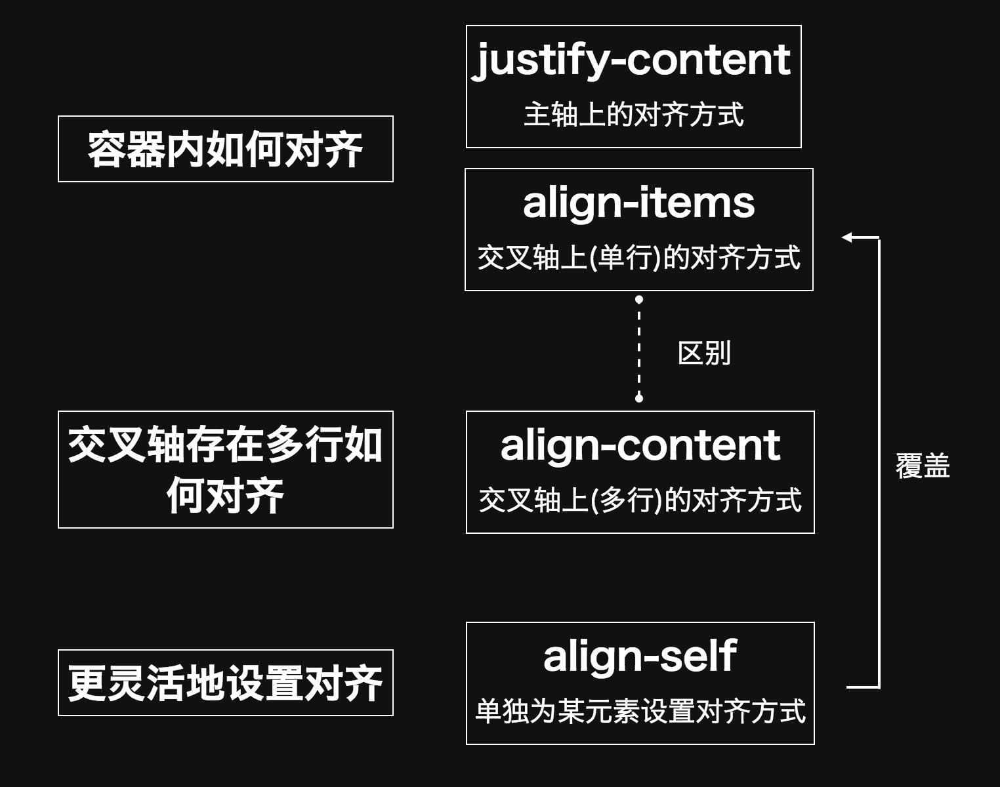