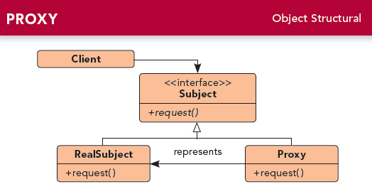
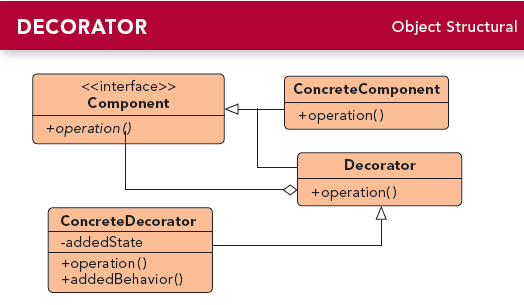
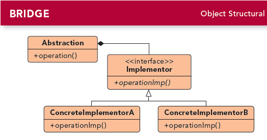
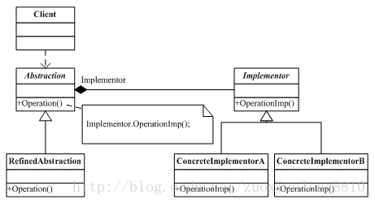
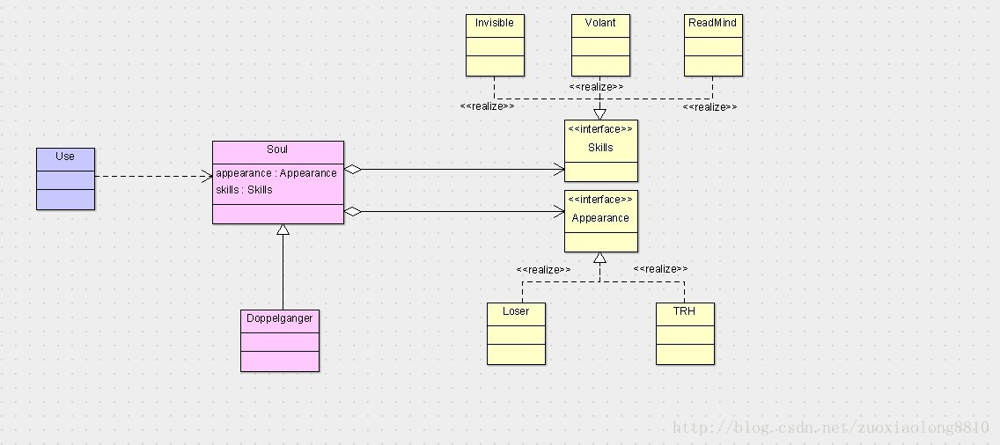
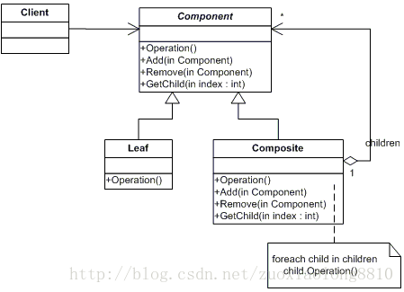
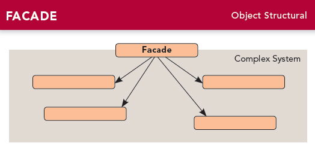
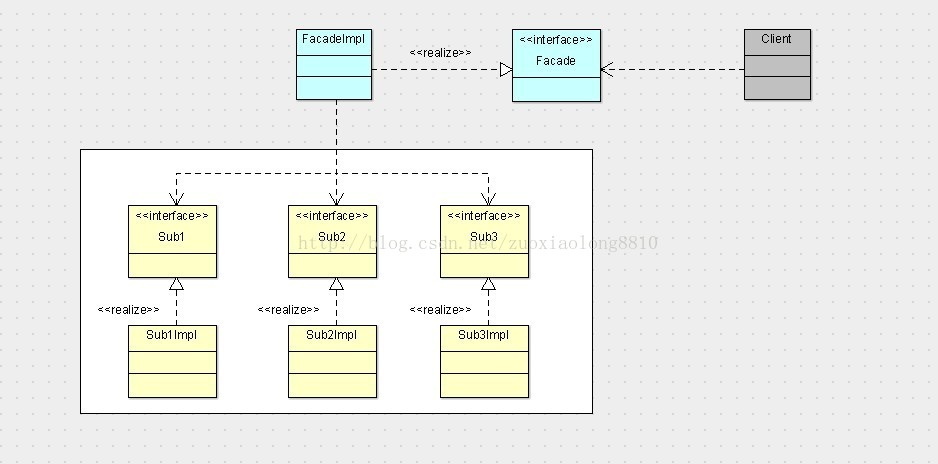
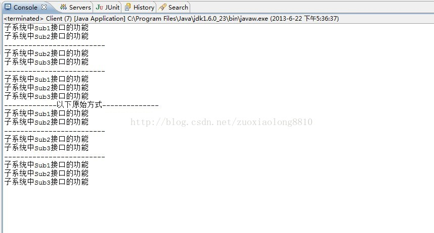

028 设计模式--结构型

## <h1 id="0">23+1 模式</h1>

- <a name="create">**创建型**：</a>单例模式 、  简单工厂模式  、 工厂方法模式 、  抽象工厂模式 、 建造者模式 、 原型模式
- <a name="structure">**结构型**：</a>  [代理模式](#1) 、  [适配器模式](#2) 、 [装饰器模式](#3) 、 [桥接模式](#4) 、[组合模式](#5) 、[享元模式](#6) 、[外观模式](#7)
-  <a name="behavior">**行为型**：</a>  观察者模式  、 模板方法模式  、 命令模式  、 状态模式 、  职责链模式 、  解释器模式 、 中介者模式  、 访问者模式 、  策略模式 、 备忘录模式 、 迭代器模式


## 结构型

##### <h2 id="1" name="agent">代理模式详解（包含原理详解）</h2>



<font size=4 face="黑体" color=red>首先代理模式，可以分为两种，一种是静态代理，一种是动态代理。</font>

两种代理从虚拟机加载类的角度来讲，本质上都是一样的，都是在原有类的行为基础上，加入一些多出的行为，甚至完全替换原有的行为。

静态代理采用的方式就是我们手动的将这些行为换进去，然后让编译器帮我们编译，同时也就将字节码在原有类的基础上加入一些其他的东西或者替换原有的东西，产生一个新的与原有类接口相同却行为不同的类型。

说归说，我们来真实的去试验一下，实验的话需要找一个示例，就拿我们的数据库连接来做例子吧。

我们都知道，数据库连接是很珍贵的资源，频繁的开关数据库连接是非常浪费服务器的CPU资源以及内存的，所以我们一般都是使用数据库连接池来解决这一问题，即创造一堆等待被使用的连接，等到用的时候就从池里取一个，不用了再放回去，数据库连接在整个应用启动期间，几乎是不关闭的，除非是超过了最大闲置时间。

但是在程序员编写程序的时候，会经常使用connection.close()这样的方法，去关闭数据库连接，而且这样做是对的，所以你并不能告诉程序员们说，你们使用连接都不要关了，去调用一个其他的类似归还给连接池的方法吧。这是不符合程序员的编程思维的，也很勉强，而且具有风险性，因为程序员会忘的。

解决这一问题的办法就是使用代理模式，因为代理模式可以替代原有类的行为，所以我们要做的就是替换掉connection的close行为。

下面是connection接口原有的样子，我去掉了很多方法，因为都类似，全贴上来占地方。
```Java
import java.sql.SQLException;
import java.sql.Statement;
import java.sql.Wrapper;

public interface Connection  extends Wrapper {
    
    Statement createStatement() throws SQLException;
    
    void close() throws SQLException;
    
}
```
这里只贴了两个方法，但是我们代理的精髓只要两个方法就能掌握，下面使用静态代理，采用静态代理我们通常会使用组合的方式，为了保持对程序猿是透明的，我们实现Connection这个接口， 如下所示。
```Java
import java.sql.SQLException;
import java.sql.Statement;


public class ConnectionProxy implements Connection{
    
    private Connection connection;
    
    public ConnectionProxy(Connection connection) {
        super();
        this.connection = connection;
    }

    public Statement createStatement() throws SQLException{
        return connection.createStatement();
    }
    
    public void close() throws SQLException{
        System.out.println("不真正关闭连接，归还给连接池");
    }

}
```
我们在构造方法中让调用者强行传入一个原有的连接，接下来我们将我们不关心的方法，交给真正的Connection接口去处理，就像createStatement方法一样，而我们将真正关心的close方法用我们自己希望的方式去进行。

此处为了更形象，我给出一个本人写的非常简单的连接池，意图在于表明实现的思路。下面我们来看一下连接池的变化，在里面注明了变化点。
```Java
import java.sql.Connection;
import java.sql.DriverManager;
import java.sql.SQLException;
import java.util.LinkedList;

public class DataSource {
    
    private static LinkedList<Connection> connectionList = new LinkedList<Connection>();
    
    static{
        try {
            Class.forName("com.mysql.jdbc.Driver");
        } catch (ClassNotFoundException e) {
            e.printStackTrace();
        }
    }
    
    private static Connection createNewConnection() throws SQLException{
        return DriverManager.getConnection("url","username", "password");
    }
    
    private DataSource(){
        if (connectionList == null || connectionList.size() == 0) {
            for (int i = 0; i < 10; i++) {
                try {
                    connectionList.add(createNewConnection());
                } catch (SQLException e) {
                    e.printStackTrace();
                }
            }
        }
    }
    
    public Connection getConnection() throws Exception{
        if (connectionList.size() > 0) {
            //return connectionList.remove();  这是原有的方式，直接返回连接，这样可能会被程序员把连接给关闭掉
            //下面是使用代理的方式，程序员再调用close时，就会归还到连接池
            return new ConnectionProxy(connectionList.remove());
        }
        return null;
    }
    
    public void recoveryConnection(Connection connection){
        connectionList.add(connection);
    }
    
    public static DataSource getInstance(){
        return DataSourceInstance.dataSource;
    }
    
    private static class DataSourceInstance{
        
        private static DataSource dataSource = new DataSource();
        
    }
    
}
```
连接池我们把它做成单例，所以假设是上述连接池的话，我们代理中的close方法可以再具体化一点，就像下面这样，用归还给连接池的动作取代关闭连接的动作。
```Java
 public void close() throws SQLException{
        DataSource.getInstance().recoveryConnection(connection);
    }
```

好了，这下我们的连接池返回的连接全是代理，就算程序员调用了close方法也只会归还给连接池了。

我们使用代理模式解决了上述问题，从静态代理的使用上来看，我们一般是这么做的。

<font size=3 face="黑体" color=blue1>1，代理类一般要持有一个被代理的对象的引用。</font>							
<font size=3 face="黑体" color=blue1>2，对于我们不关心的方法，全部委托给被代理的对象处理。</font>			
<font size=3 face="黑体" color=blue1>3，自己处理我们关心的方法。</font>		

这种代理是死的，不会在运行时动态创建，因为我们相当于在编译期，也就是你按下CTRL+S的那一刻，就给被代理的对象生成了一个不可动态改变的代理类。

静态代理对于这种，被代理的对象很固定，我们只需要去代理一个类或者若干固定的类，数量不是太多的时候，可以使用，而且其实效果比动态代理更好，因为动态代理就是在运行期间动态生成代理类，所以需要消耗的时间会更久一点。就像上述的情况，其实就比较适合使用静态代理。

下面介绍下动态代理，动态代理是JDK自带的功能，它需要你去实现一个InvocationHandler接口，并且调用Proxy的静态方法去产生代理类。

接下来我们依然使用上面的示例，但是这次该用动态代理处理，我们来试一下看如何做。
```Java
import java.lang.reflect.InvocationHandler;
import java.lang.reflect.Method;
import java.lang.reflect.Proxy;
import java.sql.Connection;


public class ConnectionProxy implements InvocationHandler{
    
    private Connection connection;
    
    public ConnectionProxy(Connection connection) {
        super();
        this.connection = connection;
    }

    public Object invoke(Object proxy, Method method, Object[] args) throws Throwable {
        //这里判断是Connection接口的close方法的话
        if (Connection.class.isAssignableFrom(proxy.getClass()) && method.getName().equals("close")) {
            //我们不执行真正的close方法
            //method.invoke(connection, args);
            //将连接归还连接池
            DataSource.getInstance().recoveryConnection(connection);
            return null;
        }else {
            return method.invoke(connection, args);
        }
    }
    
    public Connection getConnectionProxy(){
        return (Connection) Proxy.newProxyInstance(getClass().getClassLoader(), new Class[]{Connection.class}, this);
    }
    
}
```
上面是我们针对connection写的动态代理，InvocationHandler接口只有一个invoke方法需要实现，这个方法是用来在生成的代理类用回调使用的，关于动态代理的原理一会做详细的分析，这里我们先只关注用法。很显然，动态代理是将每个方法的具体执行过程交给了我们在invoke方法里处理。而具体的使用方法，我们只需要创造一个ConnectionProxy的实例，并且将调用getConnectionProxy方法的返回结果作为数据库连接池返回的连接就可以了。

上述便是我们针对connection做动态代理的方式，但是我们从中得不到任何好处，除了能少写点代码以外，因为这个动态代理还是只能代理Connection这一个接口，如果我们写出这种动态代理的方式的话，说明我们应该使用静态代理处理这个问题，因为它代表我们其实只希望代理一个类就好。从重构的角度来说，其实更简单点，那就是在你发现你使用静态代理的时候，需要写一大堆重复代码的时候，就请改用动态代理试试吧。

通常情况下，动态代理的使用是为了解决这样一种问题，就是我们需要代理一系列类的某一些方法，最典型的应用就是我们前段时间讨论过的springAOP，我们需要创造出一批代理类，切入到一系列类当中的某一些方法中。下面给出一个经常使用的动态代理方式。
```Java
import java.lang.reflect.InvocationHandler;
import java.lang.reflect.Method;
import java.lang.reflect.Proxy;


public class DynamicProxy implements InvocationHandler{
    
    private Object source;
    
    public DynamicProxy(Object source) {
        super();
        this.source = source;
    }
    
    public void before(){
        System.out.println("在方法前做一些事，比如打开事务");
    }
    
    public void after(){
        System.out.println("在方法返回前做一些事，比如提交事务");
    }

    public Object invoke(Object proxy, Method method, Object[] args) throws Throwable {
        //假设我们切入toString方法，其他其实也是类似的，一般我们这里大部分是针对特定的方法做事情的，通常不会对类的全部方法切入
        //比如我们常用的事务管理器，我们通常配置的就是对save,update,delete等方法才打开事务
        if (method.getName().equals("toString")) {
            before();
        }
        Object result = method.invoke(source, args);
        if (method.getName().equals("toString")) {
            after();
        }
        return result;
    }
    
    public Object getProxy(){
        return Proxy.newProxyInstance(getClass().getClassLoader(), source.getClass().getInterfaces(), this);
    }

}
```
上述我做了一些注释，其实已经说明一些问题，这个代理类的作用是可以代理任何类，因为它被传入的对象是Object，而不再是具体的类，比如刚才的Connection，这些产生的代理类在调用toString方法时会被插入before方法和after方法。

<font size=3 face="黑体" color=blue1>动态代理有一个强制性要求，就是被代理的类必须实现了某一个接口，或者本身就是接口，就像我们的Connection。</font>

道理其实很简单，这是因为动态代理生成的代理类是继承Proxy类的，并且会实现被你传入newProxyInstance方法的所有接口，所以我们可以将生成的代理强转为任意一个代理的接口或者Proxy去使用，但是Proxy里面几乎全是静态方法，没有实例方法，所以转换成Proxy意义不大，几乎没什么用。假设我们的类没有实现任何接口，那么就意味着你只能将生成的代理类转换成Proxy，那么就算生成了，其实也没什么用，而且就算你传入了接口，可以强转，你也用不了这个没有实现你传入接口的这个类的方法。

你可能会说，假设有个接口A，那我将接口A传给newProxyInstance方法，并代理一个没实现接口A的类B，但类B与接口A有一样的方法可以吗？

答案是可以的，并且JDK的动态代理只认你传入的接口，只要你传入，你就可以强转成这个接口，这个一会解释，但是你无法在invoke方法里调用method.invoke方法，也就是说，你只能全部替换A接口的方法，而不能使用类B中原有与接口A方法描述相同的方法，这是因为invoke中传入的Method的class信息是接口A，而类B因为没实现接口A，所以无法执行传入的Method，会抛出非法参数异常。

下面我贴出测试代码，各位可以自己试一下，具体为何会这样是在后面解释的，这里不再多做解释。
 先是一个普通接口。
```Java
public interface TestInterface {

    void method1();
    
    void method2();
    
    void method3();
}
```
然后是一个类，和接口一模一样的方法，但是就是没实现这个接口。
```
public class TestClass{

    public void method1() {
        System.out.println("TestClass.method1");
    }

    public void method2() {
        System.out.println("TestClass.method2");
    }

    public void method3() {
        System.out.println("TestClass.method3");
    }

}
```
 下面是测试类。
```Java
import java.lang.reflect.InvocationHandler;
import java.lang.reflect.Method;
import java.lang.reflect.Proxy;


public class DynamicProxy implements InvocationHandler{
    
    private Object source;
    
    public DynamicProxy(Object source) {
        super();
        this.source = source;
    }

    public Object invoke(Object proxy, Method method, Object[] args) throws Throwable {
        System.out.println("接口的方法全部变成这样了");
        //这里source是TestClass，但是我们不能使用反射调用它的方法，像下面这样，放开这一行会抛异常
        //return method.invoke(source, args);
        return null;
    }
    
    public static void main(String[] args) {
        //只要你传入就可以强转成功
        TestInterface object =  (TestInterface) Proxy.newProxyInstance(ClassLoader.getSystemClassLoader(), new Class[]{TestInterface.class}, new DynamicProxy(new TestClass()));
        object.method1();
        object.method2();
        object.method3();
    }
}
```
上面我们运行就会发现接口的方法全部都只能输出一个很2的字符串了。如果是要继续使用TestClass的方法也不是不行，只要你确认你传入的类包括了所有你传入的接口的方法，只是没实现这些接口而已，那么你可以在invoke中这样使用。
```Java
public Object invoke(Object proxy, Method method, Object[] args) throws Throwable {
    System.out.println("before");
    Method sourceMethod = source.getClass().getDeclaredMethod(method.getName(), method.getParameterTypes());
    sourceMethod.setAccessible(true);
    Object result = sourceMethod.invoke(source, args);
    System.out.println("after");
    return result;
}
```

这就与你实现接口的表现行为一致了，但是我们本来就只需要一句method.invoke就可以了，就因为没实现接口就要多写两行，所以这种突破JDK动态代理必须实现接口的行为就有点画蛇添足了。因为你本来就实现了该接口的方法，只是差了那一句implements而已。

上面写这个例子只是为了解释LZ当初的疑惑，因为LZ曾一度认为不实现接口就不能使用动态代理，现在想想那时候LZ有点2，呵呵。

好了，从现在开始，我们开始详细讲解动态代理的原理，这算是进阶篇，如果是新手的话，可以跳过下面的内容，因为现在还没必要知道这些，而且弄不好会越看越蒙，不过仅仅是LZ个人建议，你要有耐心，完全可以继续看下去。

接下来我们结合源码去看一下，代理类是如何产生的，首先当然就是要进入Proxy的newProxyInstance方法，这里是产生代理的入口，源码如下。
```Java
public static Object newProxyInstance(ClassLoader loader,
                      Class<?>[] interfaces,
                      InvocationHandler h)
    throws IllegalArgumentException
    {
    if (h == null) {
        throw new NullPointerException();
    }

    /*
     * Look up or generate the designated proxy class.
     */
    Class cl = getProxyClass(loader, interfaces);

    /*
     * Invoke its constructor with the designated invocation handler.
     */
    try {
        Constructor cons = cl.getConstructor(constructorParams);
        return (Object) cons.newInstance(new Object[] { h });
    } catch (NoSuchMethodException e) {
        throw new InternalError(e.toString());
    } catch (IllegalAccessException e) {
        throw new InternalError(e.toString());
    } catch (InstantiationException e) {
        throw new InternalError(e.toString());
    } catch (InvocationTargetException e) {
        throw new InternalError(e.toString());
    }
    }
```

 这个方法其实很简单，首先获取了代理类的运行时Class引用，然后调用了这个Class中的构造方法，这个构造方法只有一个参数，正是InvocationHandler接口，由此产生了一个代理类的实例。那么关键的地方就在于如何获取的代理类运行时的class信息的呢？我们进入getProxyClass方法看一下。为了方便起见，我直接加注释，这个方法需要解释的地方比较多。
```Java
public static Class<?> getProxyClass(ClassLoader loader,
            Class<?>... interfaces) throws IllegalArgumentException {
        //如果传入的接口长度大于65535就抛出异常，我去你妹。。。
        if (interfaces.length > 65535) {
            throw new IllegalArgumentException("interface limit exceeded");
        }
        
        Class proxyClass = null;

        /* collect interface names to use as key for proxy class cache */
        String[] interfaceNames = new String[interfaces.length];

        Set interfaceSet = new HashSet(); // for detecting duplicates

        for (int i = 0; i < interfaces.length; i++) {
            /*
             * Verify that the class loader resolves the name of this interface
             * to the same Class object.
             */
            String interfaceName = interfaces[i].getName();
            Class interfaceClass = null;
            try {
                //加载每一个接口的运行时Class信息
                interfaceClass = Class.forName(interfaceName, false, loader);
            } catch (ClassNotFoundException e) {
            }
            //如果采用你传入的类加载器载入的Class和你传入的Class不相等则抛出异常
            if (interfaceClass != interfaces[i]) {
                throw new IllegalArgumentException(interfaces[i]
                        + " is not visible from class loader");
            }

            //如果你传入的不是接口抛出异常
            /*
             * Verify that the Class object actually represents an interface.
             */
            if (!interfaceClass.isInterface()) {
                throw new IllegalArgumentException(interfaceClass.getName()
                        + " is not an interface");
            }

            //如果你传入的接口重复抛异常
            /*
             * Verify that this interface is not a duplicate.
             */
            if (interfaceSet.contains(interfaceClass)) {
                throw new IllegalArgumentException("repeated interface: "
                        + interfaceClass.getName());
            }
            interfaceSet.add(interfaceClass);

            interfaceNames[i] = interfaceName;
        }

        /*
         * Using string representations of the proxy interfaces as keys in the
         * proxy class cache (instead of their Class objects) is sufficient
         * because we require the proxy interfaces to be resolvable by name
         * through the supplied class loader, and it has the advantage that
         * using a string representation of a class makes for an implicit weak
         * reference to the class.
         */
        Object key = Arrays.asList(interfaceNames);

        /*
         * Find or create the proxy class cache for the class loader.
         */
        Map cache;
        synchronized (loaderToCache) {
            //这个是为了存储每一个类加载器所载入过的代理接口的代理类
            cache = (Map) loaderToCache.get(loader);
            if (cache == null) {
                cache = new HashMap();
                loaderToCache.put(loader, cache);
            }
            /*
             * This mapping will remain valid for the duration of this method,
             * without further synchronization, because the mapping will only be
             * removed if the class loader becomes unreachable.
             */
        }

        /*
         * Look up the list of interfaces in the proxy class cache using the
         * key. This lookup will result in one of three possible kinds of
         * values: null, if there is currently no proxy class for the list of
         * interfaces in the class loader, the pendingGenerationMarker object,
         * if a proxy class for the list of interfaces is currently being
         * generated, or a weak reference to a Class object, if a proxy class
         * for the list of interfaces has already been generated.
         */
        synchronized (cache) {
            /*
             * Note that we need not worry about reaping the cache for entries
             * with cleared weak references because if a proxy class has been
             * garbage collected, its class loader will have been garbage
             * collected as well, so the entire cache will be reaped from the
             * loaderToCache map.
             */
            do {
                //检查是否有生成好的代理
                Object value = cache.get(key);
                if (value instanceof Reference) {
                    proxyClass = (Class) ((Reference) value).get();
                }
                //有的话直接返回
                if (proxyClass != null) {
                    // proxy class already generated: return it
                    return proxyClass;
                //否则看一下这个代理类是不是正在构造中，是的话就在cache对象上等待
                } else if (value == pendingGenerationMarker) {
                    // proxy class being generated: wait for it
                    try {
                        cache.wait();
                    } catch (InterruptedException e) {
                        /*
                         * The class generation that we are waiting for should
                         * take a small, bounded time, so we can safely ignore
                         * thread interrupts here.
                         */
                    }
                    continue;
                //如果没有现成的，也没有创造中的，那就开始创造代理类
                } else {
                    /*
                     * No proxy class for this list of interfaces has been
                     * generated or is being generated, so we will go and
                     * generate it now. Mark it as pending generation.
                     */
                    //将当前代理类置为正在构造中，并直接退出循环
                    cache.put(key, pendingGenerationMarker);
                    break;
                }
            } while (true);
        }

        try {
            String proxyPkg = null; // package to define proxy class in

            //这一段是看你传入的接口中有没有不是public的接口，如果有，这些接口必须全部在一个包里定义的，否则抛异常
            /*
             * Record the package of a non-public proxy interface so that the
             * proxy class will be defined in the same package. Verify that all
             * non-public proxy interfaces are in the same package.
             */
            for (int i = 0; i < interfaces.length; i++) {
                int flags = interfaces[i].getModifiers();
                if (!Modifier.isPublic(flags)) {
                    String name = interfaces[i].getName();
                    int n = name.lastIndexOf('.');
                    String pkg = ((n == -1) ? "" : name.substring(0, n + 1));
                    if (proxyPkg == null) {
                        proxyPkg = pkg;
                    } else if (!pkg.equals(proxyPkg)) {
                        throw new IllegalArgumentException(
                                "non-public interfaces from different packages");
                    }
                }
            }

            if (proxyPkg == null) { // if no non-public proxy interfaces,
                proxyPkg = ""; // use the unnamed package
            }

            {
                /*
                 * Choose a name for the proxy class to generate.
                 */
                long num;
                synchronized (nextUniqueNumberLock) {
                    num = nextUniqueNumber++;
                }
                //生成一个随机代理类名
                String proxyName = proxyPkg + proxyClassNamePrefix + num;
                /*
                 * Verify that the class loader hasn't already defined a class
                 * with the chosen name.
                 */
                
                //这一句就是重中之重了，生成代理类的class文件，这就是JDK动态代理的原理了，通过动态生成class文件来产生的代理类
                //这个generateProxyClass方法下面会着重介绍
                /*
                 * Generate the specified proxy class.
                 */
                byte[] proxyClassFile = ProxyGenerator.generateProxyClass(
                        proxyName, interfaces);
                try {
                    //得到class文件二进制流后，直接载入代理类
                    proxyClass = defineClass0(loader, proxyName,
                            proxyClassFile, 0, proxyClassFile.length);
                } catch (ClassFormatError e) {
                    /*
                     * A ClassFormatError here means that (barring bugs in the
                     * proxy class generation code) there was some other invalid
                     * aspect of the arguments supplied to the proxy class
                     * creation (such as virtual machine limitations exceeded).
                     */
                    throw new IllegalArgumentException(e.toString());
                }
            }
            //proxyClasses这个Map是为了来判断是不是代理的Class
            // add to set of all generated proxy classes, for isProxyClass
            proxyClasses.put(proxyClass, null);

        } finally {
            /*
             * We must clean up the "pending generation" state of the proxy
             * class cache entry somehow. If a proxy class was successfully
             * generated, store it in the cache (with a weak reference);
             * otherwise, remove the reserved entry. In all cases, notify all
             * waiters on reserved entries in this cache.
             */
            synchronized (cache) {
                if (proxyClass != null) {
                    //最终将生成的代理用弱引用包装起来放到cache当中
                    cache.put(key, new WeakReference(proxyClass));
                } else {
                    //如果代理类是空则移除代理的接口所代表的key值
                    cache.remove(key);
                }
                //通知正在等待在cache对象上的线程，告诉他们可以继续了，代理Class加载完毕了
                cache.notifyAll();
            }
        }
        return proxyClass;
    }
```
上面基本上已经解释的很清楚了，下面就是去看一下byte[] proxyClassFile = ProxyGenerator.generateProxyClass(proxyName, interfaces)这句话是如何处理的，也就是如何得到的代理类的class文件的，我们进去源码看一下，我依然会加上注释。
```Java
public static byte[] generateProxyClass(String paramString, Class[] paramArrayOfClass) {
        //新建一个ProxyGenerator实例，传入类名和接口数组
        ProxyGenerator localProxyGenerator = new ProxyGenerator(paramString, paramArrayOfClass);
        //这个才是真正生成class文件的地方
        final byte[] arrayOfByte = localProxyGenerator.generateClassFile();
        //看保存生成文件的标志是否为真，如果是就将class文件生成到本地，生成时要检查权限
        if (saveGeneratedFiles) {
            AccessController.doPrivileged(new PrivilegedAction() {
                public Object run() {
                    try {
                        FileOutputStream localFileOutputStream = new FileOutputStream( ProxyGenerator.dotToSlash(this.val$name) + ".class");
                        localFileOutputStream.write(arrayOfByte);
                        localFileOutputStream.close();
                        return null;
                    } catch (IOException localIOException) {
                        throw new InternalError( "I/O exception saving generated file: " + localIOException);
                    }
                }

            });
        }

        return arrayOfByte;
    }
```
我们继续跟踪到localProxyGenerator.generateClassFile()这一句当中，依然会加上注释。
```Java
private byte[] generateClassFile() {
        //addProxyMethod方法，就是将方法都加入到一个列表中，并与对应的class对应起来
        //这里给Object对应了三个方法hashCode，toString和equals
        addProxyMethod(hashCodeMethod, Object.class);
        addProxyMethod(equalsMethod, Object.class);
        addProxyMethod(toStringMethod, Object.class);

        //同样将接口与接口下的方法对应起来
        for (int i = 0; i < this.interfaces.length; i++) {
            localObject1 = this.interfaces[i].getMethods();
            for (int k = 0; k < localObject1.length; k++) {
                addProxyMethod(localObject1[k], this.interfaces[i]);
            }

        }
        //检查所有代理方法的返回类型
        for (Iterator localIterator1 = this.proxyMethods.values().iterator(); localIterator1
                .hasNext();) {
            localObject1 = (List) localIterator1.next();
            checkReturnTypes((List) localObject1);
        }

        Object localObject2;
        try {
            //方法中加入构造方法，这个构造方法只有一个，就是一个带有InvocationHandler接口的构造方法
            //这个才是真正给class文件，也就是代理类加入方法了，不过还没真正处理，只是先加进来等待循环，构造方法在class文件中的名称描述是<init>
            this.methods.add(generateConstructor());
            //循环代理方法
            for (localIterator1 = this.proxyMethods.values().iterator(); localIterator1
                    .hasNext();) {
                localObject1 = (List) localIterator1.next();
                for (localIterator2 = ((List) localObject1).iterator(); localIterator2
                        .hasNext();) {
                    localObject2 = (ProxyMethod) localIterator2.next();
                    //给每一个代理方法加一个Method类型的属性，数字10是class文件的标识符，代表这些属性都是private static的
                    this.fields.add(new FieldInfo(((ProxyMethod) localObject2).methodFieldName,"Ljava/lang/reflect/Method;", 10));
                    //将每一个代理方法都加到代理类的方法中
                    this.methods.add(((ProxyMethod) localObject2).generateMethod());
                }
            }
            Iterator localIterator2;
            //加入一个静态初始化块，将每一个属性都初始化，这里静态代码块也叫类构造方法，其实就是名称为<clinit>的方法，所以加到方法列表
            this.methods.add(generateStaticInitializer());
        } catch (IOException localIOException1) {
            throw new InternalError("unexpected I/O Exception");
        }
        //方法和属性个数都不能超过65535，包括刚才的接口个数也是这样，
        //这是因为在class文件中，这些个数都是用4位16进制表示的，所以最大值是2的16次方-1
        if (this.methods.size() > 65535) {
            throw new IllegalArgumentException("method limit exceeded");
        }
        if (this.fields.size() > 65535) {
            throw new IllegalArgumentException("field limit exceeded");
        }
        //这里是将类名中的.转成成斜线为了写入class文件。
        this.cp.getClass(dotToSlash(this.className));
        this.cp.getClass("java/lang/reflect/Proxy");
        for (int j = 0; j < this.interfaces.length; j++) {
            this.cp.getClass(dotToSlash(this.interfaces[j].getName()));
        }

        this.cp.setReadOnly();
        //这里开始真正的写class文件
        ByteArrayOutputStream localByteArrayOutputStream = new ByteArrayOutputStream();
        Object localObject1 = new DataOutputStream(localByteArrayOutputStream);
        try {
            //写入class文件的标识号，标识这是一个class文件
            ((DataOutputStream) localObject1).writeInt(-889275714);
            //次版本号0
            ((DataOutputStream) localObject1).writeShort(0);
            //主版本号，49代表的是JDK1.5
            ((DataOutputStream) localObject1).writeShort(49);
            //这里写入的是常量池，包括一些属性名称，类名称，方法描述符，属性描述符等等，常量池在加载时会被放到方法区或者说永久代。
            this.cp.write((OutputStream) localObject1);
            //这里写入的是这个类的访问标识，49代表的是public final，也就是说JDK动态代理生成的代理类都是final的
            ((DataOutputStream) localObject1).writeShort(49);
            //写入代理类的类名
            ((DataOutputStream) localObject1).writeShort(this.cp
                    .getClass(dotToSlash(this.className)));
            //写入代理类的父类类名，也就是Proxy类，这个位置的类如果说是JAVA文件，相当于extend后面的类，也就是父类
            ((DataOutputStream) localObject1).writeShort(this.cp
                    .getClass("java/lang/reflect/Proxy"));
            //写入代理类所实现的接口数量
            ((DataOutputStream) localObject1)
                    .writeShort(this.interfaces.length);
            //写入代理类所实现的接口类名，同样的，对于JAVA文件来说，相当于implements后面的接口，也就是实现的接口
            for (int m = 0; m < this.interfaces.length; m++) {
                ((DataOutputStream) localObject1).writeShort(this.cp
                        .getClass(dotToSlash(this.interfaces[m].getName())));
            }
            //写入属性个数
            ((DataOutputStream) localObject1).writeShort(this.fields.size());
            //写入属性描述
            for (Iterator localIterator3 = this.fields.iterator(); localIterator3
                    .hasNext();) {
                localObject2 = (FieldInfo) localIterator3.next();
                ((FieldInfo) localObject2)
                        .write((DataOutputStream) localObject1);
            }
            //写入方法个数
            ((DataOutputStream) localObject1).writeShort(this.methods.size());
            //写入方法描述，方法的code属性，以及构造方法和类构造方法都在这里被写入了。
            for (localIterator3 = this.methods.iterator(); localIterator3
                    .hasNext();) {
                localObject2 = (MethodInfo) localIterator3.next();
                ((MethodInfo) localObject2)
                        .write((DataOutputStream) localObject1);
            }
            //结束
            ((DataOutputStream) localObject1).writeShort(0);
        } catch (IOException localIOException2) {
            throw new InternalError("unexpected I/O Exception");
        }

        return localByteArrayOutputStream.toByteArray();
    }
```
其实代理类的class文件并不复杂，还是有很多规律可循的，所以上述过程基本上可以让各位了解下JDK动态代理生成代理类时都生成了什么东西。

下面我们可以调用下JDK中生成Class文件的方法，并且写入到本地文件，然后使用反编译工具来看一下生成的代理类到底是什么样子的。下面是生成文件的测试类。我们暂且将生成的类名写成TestProxy，代理的接口就是我们上面的TestInterface。如下。
```Java
import java.io.File;
import java.io.FileOutputStream;
import java.io.IOException;

import sun.misc.ProxyGenerator;


public class CreateClassTest {

    public static void main(String[] args) throws IOException {
        byte[] classFile = ProxyGenerator.generateProxyClass("TestProxy", new Class[]{TestInterface.class});
        File file = new File("F:/TestProxy.class");
        FileOutputStream fos = new FileOutputStream(file);
        fos.write(classFile);
        fos.flush();
        fos.close();
    }
    
}
```
生成后，我们反编译过来会是如下格式的JAVA文件。我加入了注释，大致说明了下文件中生成的部分与刚才分析的时候写入的过程的对应关系。
```Java
import java.lang.reflect.InvocationHandler;
import java.lang.reflect.Method;
import java.lang.reflect.Proxy;
import java.lang.reflect.UndeclaredThrowableException;

//public final的，继承Proxy，实现你传入的接口
public final class TestProxy extends Proxy
  implements TestInterface
{
  //private static 的Method属性，对应所有方法
  private static Method m1;
  private static Method m5;
  private static Method m3;
  private static Method m4;
  private static Method m0;
  private static Method m2;
  //唯一的构造方法，需要一个InvocationHandler接口传入
  public TestProxy(InvocationHandler paramInvocationHandler)
    throws 
  {
    super(paramInvocationHandler);
  }
  //重写Object的三个方法
  public final boolean equals(Object paramObject)
    throws 
  {
    try
    {
      return ((Boolean)this.h.invoke(this, m1, new Object[] { paramObject })).booleanValue();
    }
    catch (Error|RuntimeException localError)
    {
      throw localError;
    }
    catch (Throwable localThrowable)
    {
      throw new UndeclaredThrowableException(localThrowable);
    }
  }

  public final void method3()
    throws 
  {
    try
    {
      this.h.invoke(this, m5, null);
      return;
    }
    catch (Error|RuntimeException localError)
    {
      throw localError;
    }
    catch (Throwable localThrowable)
    {
      throw new UndeclaredThrowableException(localThrowable);
    }
  }
  //代理的三个方法，回调传入的InvocationHandler的invoke方法
  public final void method1()
    throws 
  {
    try
    {
      this.h.invoke(this, m3, null);
      return;
    }
    catch (Error|RuntimeException localError)
    {
      throw localError;
    }
    catch (Throwable localThrowable)
    {
      throw new UndeclaredThrowableException(localThrowable);
    }
  }

  public final void method2()
    throws 
  {
    try
    {
      this.h.invoke(this, m4, null);
      return;
    }
    catch (Error|RuntimeException localError)
    {
      throw localError;
    }
    catch (Throwable localThrowable)
    {
      throw new UndeclaredThrowableException(localThrowable);
    }
  }

  public final int hashCode()
    throws 
  {
    try
    {
      return ((Integer)this.h.invoke(this, m0, null)).intValue();
    }
    catch (Error|RuntimeException localError)
    {
      throw localError;
    }
    catch (Throwable localThrowable)
    {
      throw new UndeclaredThrowableException(localThrowable);
    }
  }

  public final String toString()
    throws 
  {
    try
    {
      return (String)this.h.invoke(this, m2, null);
    }
    catch (Error|RuntimeException localError)
    {
      throw localError;
    }
    catch (Throwable localThrowable)
    {
      throw new UndeclaredThrowableException(localThrowable);
    }
  }
  //这个就是刚才this.methods.add(generateStaticInitializer());这一句话所加入的静态初始化块，初始化每一个属性
  static
  {
    try
    {//每一个属性所代表的Method都是与上面加入代理方法列表时与固定类绑定的，这是class文件中的格式，方法要与固定的类绑定
      m1 = Class.forName("java.lang.Object").getMethod("equals", new Class[] { Class.forName("java.lang.Object") });
      m5 = Class.forName("TestInterface").getMethod("method3", new Class[0]);
      m3 = Class.forName("TestInterface").getMethod("method1", new Class[0]);
      m4 = Class.forName("TestInterface").getMethod("method2", new Class[0]);
      m0 = Class.forName("java.lang.Object").getMethod("hashCode", new Class[0]);
      m2 = Class.forName("java.lang.Object").getMethod("toString", new Class[0]);
      return;
    }
    catch (NoSuchMethodException localNoSuchMethodException)
    {
      throw new NoSuchMethodError(localNoSuchMethodException.getMessage());
    }
    catch (ClassNotFoundException localClassNotFoundException)
    {
      throw new NoClassDefFoundError(localClassNotFoundException.getMessage());
    }
  }
}
```
看到这里就知道invoke方法是干嘛的了，其实就是<font size=3 face="黑体" color=red>生成的代理类对每一个方法的处理就是回调invoke方法</font>。从生成的代理类源文件中也可以发现，每一个Method除了hashCode，toString和equals外，都是与所属的接口绑定的，所以这也就解释了为什么我们不实现这个接口，只传入进入的话，不能直接使用method.invoke，而是要转成source对应的method才可以调用。

好了，代理模式就分析到这里了，这里讲的更多的是代理模式的原理，对于如何使用并没有讲述太多，是因为代理模式在平时工作中用的虽然很多，但我们大多是使用的现成的，原因很简单，就是因为spring的AOP已经给我们弄了一个很好的动态代理的框架，所以我们几乎不需要自己去写，只要明白其原理，知道动态代理和静态代理主要处理的问题是那种的，知道在何处用，也能够用起来得心应手就可以了，当然这只是LZ个人之见，仅供参考。[代理模式](#1) | [行为型](#0)

##### <h2 id="2" name="adapter">适配器模式详解</h2>


**特点:** 将一个接口装换成客户端的一个接口

**关系:** 适配器接口和被适配器接口没有层次关系

**举例:** Java AWT 、 Java I/O 、Spring Web MVC

<font size=3 face="黑体" color=red>&emsp;&emsp;适配器模式从实现方式上分为两种，类适配器和对象适配器，这两种的区别在于实现方式上的不同，一种采用继承，一种采用组合的方式。</font>

&emsp;&emsp;**另外从使用目的上来说，也可以分为两种，特殊适配器和缺省适配器，这两种的区别在于使用目的上的不同，一种为了复用原有的代码并适配当前的接口，一种为了提供缺省的实现，避免子类需要实现不该实现的方法。**

&emsp;&emsp;首先应该明白一点，适配器模式是补救措施，所以在系统设计过程中请忘掉这个设计模式，这个模式只是在你无可奈何时的补救方式。

&emsp;&emsp;那么我们什么时候使用这个模式呢？<font face="黑体" color=#6753FF size=3>**场景通常情况下是，系统中有一套完整的类结构，而我们需要利用其中某一个类的功能（通俗点说可以说是方法），但是我们的客户端只认识另外一个和这个类结构不相关的接口，这时候就是适配器模式发挥的时候了，我们可以将这个现有的类与我们的目标接口进行适配，最终获得一个符合需要的接口并且包含待复用的类的功能的类。**</font>

&emsp;&emsp;接下来我们举一个例子，比如我们在观察者一章中就提到一个问题，就是说观察者模式的一个缺点，即如果一个现有的类没有实现Observer接口，那么我们就无法将这个类作为观察者加入到被观察者的观察者列表中了，这实在太遗憾了。

&emsp;&emsp;在这个问题中，我们需要得到一个Observer接口的类，但是又想用原有的类的功能，但是我们又改不了这个原来的类的代码，或者原来的类有一个完整的类体系，我们不希望破坏它，那么适配器模式就是你的不二之选了。

我们举个具体的例子，比如我们希望将HashMap这个类加到观察者列表里，在被观察者产生变化时，假设我们要清空整个MAP。但是现在加不进去啊，为什么呢？

因为Observable的观察者列表只认识Observer这个接口，它不认识HashMap，怎么办呢？

这种情况下，我们就可以使用类适配器的方式将我们的HashMap做点手脚，刚才已经说了，类适配器采用继承的方式，那么我们写出如下适配器。
```Java
public class HashMapObserverAdapter<K, V> extends HashMap<K, V> implements Observer{

    public void update(Observable o, Object arg) {
        //被观察者变化时，清空Map
        super.clear();
    }

}
```

即我们继承我们希望复用其功能的类，并且实现我们想适配的接口，在这里就是Observer，那么就会产生一个适配器，这个适配器具有原有类（即HashMap）的功能，又具有观察者接口，所以这个适配器现在可以加入到观察者列表了。

看，类适配器很简单吧？那么下面我们来看看对象适配器，刚才说了对象适配器是采用组合的方式实现。

为什么要采用组合呢？上面的方式不是很好吗？

究其根本，是因为JAVA单继承的原因，一个JAVA类只能有一个父类，所以当我们要适配的对象是两个类的时候，你怎么办呢？你难道要将两个类全部写到extends后面吗，如果你这么做了，那么编译器会表示它的不满的。

我们还是拿观察者模式那一章的例子来说（观察者模式比较惨，老要适配器模式擦屁股），比如我们现在有一个写好的类，假设就是个实体类吧。如下。

```Java
public class User extends BaseEntity{
    private Integer id;
    private String name;
    public Integer getId() {
        return id;
    }
    public void setId(Integer id) {
        this.id = id;
    }
    public String getName() {
        return name;
    }
    public void setName(String name) {
        this.name = name;
    }
}
```
看到了吧，我们的实体类大部分都是继承自BaseEntity的，那现在你怎么办吧，你要想具有被观察者的功能还要继承Observable类，你说你怎么继承吧。

你是不是想说，那我的User不继承BaseEntity不就完事了，我把BaseEntity里面的东西全部挪动到User类，或者我不继承Observable了，把Observable里面的东西全部挪到User类里面。

这并不是不行，但是这是个很大的隐患，比如我们项目到时候要针对BaseEntity的子类进行扫描，用来做一些事情，这时候如果User没继承BaseEntity，那么你就会遗漏掉这个类，这会破坏你的继承体系，付出太大了。

相反，如果你不继承Observable，那么你的User类看起来会非常杂乱，而且假设我现在不仅User类可以被观察了，我的Person类，Employee都能被观察了，你难道要把Observable的代码COPY三次到这三个类里面吗？

不要忘了刚才说的，适配器模式就是为了帮助我们复用代码的，这里使用适配器模式就可以帮我们复用Observable的代码或者说功能。

基于上面LZ的讨论，我们做出如下适配器，这里采用的对象适配器。
```Java
//我们继承User,组合Observable.
public class ObservableUser extends User{
    
    private Observable observable = new Observable();

    public synchronized void addObserver(Observer o) {
        observable.addObserver(o);
    }

    public synchronized void deleteObserver(Observer o) {
        observable.deleteObserver(o);
    }

    public void notifyObservers() {
        observable.notifyObservers();
    }

    public void notifyObservers(Object arg) {
        observable.notifyObservers(arg);
    }

    public synchronized void deleteObservers() {
        observable.deleteObservers();
    }

    protected synchronized void setChanged() {
        observable.setChanged();
    }

    protected synchronized void clearChanged() {
        observable.clearChanged();
    }

    public synchronized boolean hasChanged() {
        return observable.hasChanged();
    }

    public synchronized int countObservers() {
        return observable.countObservers();
    }
    
    
}
```
我们继承User，而不是继承Observable，这个原因刚才已经说过了，我们不能破坏项目中的继承体系，所以现在可观察的User（ObservableUser）依然处于我们实体的继承体系中，另外如果想让ObservableUser具有User的属性，则需要将User的属性改为protected。

这下好了，我们有了可观察的User了。不过LZ早就说过，设计模式要活用，这里明显不是最好的解决方案。因为我们要是还有Person,Employee类都要具有可观察的功能的话，那其实也相当惨，因为下面那些Observable的方法我们还要再复制一遍。

提示到这里，不知各位想到更好的解决方案了吗？尤其是新手可以好好思考下。

LZ这里给出最终相对来说比较好的解决方案，那就是我们定义如下可观察的基类。
```Java
//我们扩展BaseEntity,适配出来一个可观察的实体基类
public class BaseObservableEntity extends BaseEntity{

    private Observable observable = new Observable();

    public synchronized void addObserver(Observer o) {
        observable.addObserver(o);
    }

    public synchronized void deleteObserver(Observer o) {
        observable.deleteObserver(o);
    }

    public void notifyObservers() {
        observable.notifyObservers();
    }

    public void notifyObservers(Object arg) {
        observable.notifyObservers(arg);
    }

    public synchronized void deleteObservers() {
        observable.deleteObservers();
    }

    protected synchronized void setChanged() {
        observable.setChanged();
    }

    protected synchronized void clearChanged() {
        observable.clearChanged();
    }

    public synchronized boolean hasChanged() {
        return observable.hasChanged();
    }

    public synchronized int countObservers() {
        return observable.countObservers();
    }
    
}
```
这下好了，现在我们的User，Person，Employee要是想具有可被观察的功能，那就改去继承我们适配好的BaseObservableEntity就好了，而且由于BaseObservableEntity继承了BaseEntity，所以他们三个依然处于我们实体的继承体系中，而且由于我们的BaseObservableEntity是新增的扩展基类，所以不会对原来的继承体系造成破坏。

适配器模式的用法还是比较清晰的，我们以上两种方式都是为了复用现有的代码而采用的适配器模式，LZ刚才说了，根据目的的不同，适配器模式也可以分为两种，那么上述便是第一种，可称为**定制适配器**，还有另外一种称为**缺省适配器**。

首先我们得先说下缺省适配器为什么要出现，因为适配器模式大部分情况下是为了补救，所以既然补救，那么肯定是历史原因造成的我们需要使用这个模式。

我们来看看缺省适配器的历史来由，不知各位还是否记得在第一章总纲中，LZ曾经提到过一个原则，最小接口原则。

这个原则所表达的思想是说接口的行为应该尽量的少，那么还记得LZ当时说如果你没做到的话会产生什么情况吗？

**结果就是实现这个接口的子类，很可能出现很多方法是空着的情况，因为你的接口设计的过大，导致接口中原本不该出现的方法出现了，结果现在子类根本用不上这个方法，但由于JAVA语言规则的原因，实现一个接口必须实现它的全部方法，所以我们的子类不得不被迫写一堆空方法在那，只为了编译通过。**

所以为了解决这一问题，缺省适配器就出现了。比如我们有如下接口。
```Java
public interface Person {
    
    void speak();
    
    void listen();
    
    void work();
    
}
```

这是一个人的接口，这个接口表示了人可以说话，听和工作，假设是两年前的LZ，还在家待业呢，LZ没工作啊，但是LZ也是个人啊，所以LZ要实现这个接口，所以LZ只能把work方法抄下来空着放在那了，假设LZ是个聋哑人，好吧，三个方法都要空着了，但是LZ表示，LZ是人，LZ一定要实现Person接口。

当然，上述只是举个例子，但是真实项目当中也会出现类似的情况，那么怎么办呢？

这下来了，我们的缺省适配器来了，如下。
```Java
public class DefaultPerson implements Person{

    public void speak() {
    }

    public void listen() {
    }

    public void work() {
    }

}
```

我们创造一个Person接口的默认实现，它里面都是一些默认的方法，当然这里因为没什么可写的就空着了，实际当中可能会加入一些默认情况下的操作，比如如果方法返回结果整数，那么我们在缺省适配器中可以默认返回个0。

这下好了，LZ只要继承这个默认的适配器（DefaultPerson），然后覆盖掉LZ感兴趣的方法就行了，比如speak和listen，至于work，由于适配器帮我们提供了默认的实现，所以就不需要再写了。

这种情况其实蛮多的，因为接口设计的最小化只是理想状态，难免会有一些实现类，对其中某些方法不感兴趣，这时候，如果方法过多，子类也很多，并且子类的大部分方法都是空着的，那么就可以采取这种方式了。

当然，这样做违背了里氏替换原则，但是上面的做法原本就违背了接口的最小化原则，所以我们在真正使用时要权衡二者的利弊，到底我们需要的是什么。所以从此也可以看出来，原则只是指导，并不一定也不可能全部满足，所以我们一定要学会取舍。

总结下两种实现方式的适配器所使用的场景，两者都是为了将已有类的代码复用并且适配到客户端需要的接口上去。


- [x]  **1，第一种类适配器，一般是针对适配目标是接口的情况下使用。**			


- [x]  **2，第二种对象适配器，一般是针对适配目标是类或者是需要复用的对象多于一个的时候使用，这里再专门提示一下，对象适配器有时候是为了将多个类一起适配，所以才不得不使用组合的方式，而且我们采用对象适配器的时候，继承也不是必须的，而是根据实际的类之间的关系来进行处理，上述例子当中一定要直接或间接的继承自BaseEntity是为了不破坏我们原来的继承体系，但有些情况下这并不是必须的。**

**对于第三个缺省适配器，一般是为了弥补接口过大所犯下的过错，但是也请注意衡量利弊，权衡好以后再考虑是否要使用缺省适配器。**

好了，本次适配器模式的分享就到此结束了，希望各位可以从中得到点收获。 [适配器模式](#2) | [结构型](#0)

##### <h2 id="3" name="decorator" >装饰器模式详解（与IO不解的情缘）</h2>



**特点** 动态添加或者覆盖被包装者的接口行为

**关系** 装饰者和被装饰者接口有层次关系（几乎都依靠继承来实现）

**举例** Java I/O、Spring Core、Spring Web MVC

**装饰器模式是一种结构性模式，它作用是对对象已有功能进行增强，但是不改变原有对象结构。这避免了通过继承方式进行功能扩充导致的类体系臃肿。**

LZ到目前已经写了九个设计模式，回过去看看，貌似写的有点凌乱，LZ后面会尽量改进。

那么本章LZ和各位读友讨论一个与JAVA中IO有着不解情缘的设计模式，装饰器模式。

**定义：装饰模式是在不必改变原类文件和使用继承的情况下，动态的扩展一个对象的功能。它是通过创建一个包装对象，也就是装饰来包裹真实的对象。**

这一个解释，引自百度百科，我们注意其中的几点。

**1，不改变原类文件。**

**2，不使用继承。**

**3，动态扩展。**

上述三句话一语道出了装饰器模式的特点，下面LZ给出装饰器模式的类图，先上图再解释。[装饰器模式](#3) | [结构型](#0)

##### <h2 id="4" name="bridge">桥接模式详解</h2>



<font size=3 face="黑体" color=#f41865 >定义：在软件系统中，某些类型由于自身的逻辑，它具有两个或多个维度的变化，那么如何应对这种“多维度的变化”？如何利用面向对象的技术来使得该类型能够轻松的沿着多个方向进行变化，而又不引入额外的复杂度？这就要使用Bridge模式。而具体使用的方式，则是将抽象部分与他们的实现部分分离，使得它们都可以独立的变化。</font>

“桥接模式中说到了某些类型，会有两个或多个维度的变化，这里指的不正是我的分身吗。我的分身既可以按外貌分类，即屌丝和高富帅，又可以按技能分类，即隐身、飞行和读心术。不过这使用方式倒是说的有些模糊。”小左看着桥接模式的定义，喃喃的说道。

“还是看下类图吧，说不定能找到一些端倪。”说着，小左就在度娘上打开了桥接模式的类图。



从类图上看，抽象部分的具体行为交给了实现部分，而就我目前的情况来说，我的不同实现有两种，一种是外貌，一种是技能。这么说的话，<font size=3 face="黑体" color=#f41865 >抽象部分和实现部分，通常意义下，应该指的是继承体系中，接口相同而实现也相同的部分则为抽象部分，而接口相同但是实现不同的部分则为实现部分。”</font>

“这样的话，按照我目前的情况，制作分身以及像正常人一样做任何事的方法则是抽象部分，而形象的展示和技能的释放则是实现部分了。下面我就尝试着来分离一下吧，哈哈！”有了解决方案，小左不禁心情大好，慌里慌张的就开始尝试着分离抽象和实现部分。

“首先，我要将实现部分给写出来，这里有两个维度，一个是技能，一个是外貌。”

```Java
package com.bridge;

//技能接口
public interface Skills {
    
    public void releaseSkills();

}

//隐身技能
class Invisible implements Skills{

    public void releaseSkills(){
        System.out.println("释放隐身技能");
    }
}
//飞行技能
class Volant implements Skills{

    public void releaseSkills(){
        System.out.println("释放飞行技能");
    }
}
//读心术技能
class ReadMind implements Skills{

    public void releaseSkills(){
        System.out.println("释放读心术技能");
    }
}
```

```Java
package com.bridge;
//外貌接口
public interface Appearance {
    
    public void show();

}
//屌丝外形
class Loser implements Appearance{

    public void show() {
        System.out.println("展示屌丝形象");
    }
    
}
//高富帅外形
class TRH implements Appearance{

    public void show() {
        System.out.println("展示高富帅形象");
    }
    
}
```
“这便是两个实现化的部分了，现在我已经将它分离出来，剩下的就是要将他们加入到灵魂基类中了。”
```Java
package com.bridge;
//抽象灵魂类
public abstract class Soul {
    
    protected Appearance appearance;//外貌
    
    protected Skills skills;//技能

    //具体的实现交给实现部分处理
    public void show(){
        appearance.show();
    }
    //具体的实现交给实现部分处理
    public void releaseSkills(){
        skills.releaseSkills();
    }
    
    public void createDoppelganger(){
        System.out.println("制作分身");
    }
    //抽象的方法，留给分身实现
    public abstract void doAllLikePeople();
    
    public Soul() {
        super();
    }
    
    public Soul(Skills skills) {
        super();
        this.skills = skills;
    }

    public Soul(Appearance appearance) {
        super();
        this.appearance = appearance;
    }

    public Soul(Appearance appearance, Skills skills) {
        super();
        this.appearance = appearance;
        this.skills = skills;
    }

    public Appearance getAppearance() {
        return appearance;
    }

    public void setAppearance(Appearance appearance) {
        this.appearance = appearance;
    }

    public Skills getSkills() {
        return skills;
    }

    public void setSkills(Skills skills) {
        this.skills = skills;
    }

}
```
“这下已经基本搞定了，最后一步则是我要修正一下灵魂类，因为灵魂类只是定义了抽象化的角色，它是需要分身类来修正以后，才可以拥有真正的像人类一样活动的能力。”
```Java
package com.bridge;

//分身类
public class Doppelganger extends Soul{
    
    public Doppelganger(){
        System.out.println("制作一个暂无外貌和技能的分身");
    }

    public void doAllLikePeople(){
        System.out.println("分身可以像正常人一样做任何事");
    }

}
```
“OK了，这下我来看一下现在要使用的话要怎么使用吧。”到了此时，小左明显已经有点迫不及待了。
```Java
package com.bridge;

public class Use {

    public static void main(String[] args) {
        Soul soul = new Doppelganger();
        soul.setAppearance(new TRH());//设置分身外貌为高富帅
        soul.setSkills(new Invisible());//设置隐身技能
        soul.doAllLikePeople();
        System.out.println("----------------------------");
        soul.show();
        soul.releaseSkills();
        System.out.println("----------------------------");
        //切换技能
        soul.setSkills(new ReadMind());
        soul.releaseSkills();
        System.out.println("----------------------------");
        //切换外貌
        soul.setAppearance(new Loser());
        soul.show();
        System.out.println("----------------------------");
        //切换技能
        soul.setSkills(new Volant());
        soul.releaseSkills();
    }
    
}
```


总结一下：



缺点：

- 第一，子类太多。

- 第二，由于客户端与具体子类的耦合度很高，导致在子类间切换非常繁琐。

- 第三，如果以后需要扩展子类功能的话，则子类的数目会随着维度以及每一个维度中子类的个数的增加呈几何倍数增长。

优点：

- 第一，子类的数目减少了。

- 第二，实现部分的切换非常容易，主要表现在抽象部分和实现部分的耦合度很低，因为使用聚合取代了继承。

- 第三，扩展的时候很简单，可以更好的容纳变化，不论是维度的增加还是每一个维度中子类的个数的增加，都会变得非常简单。[桥接模式](#4) | [结构型](#0)

##### <h2 id="5" name="combination" >组合模式详解</h2>


**特定：** 执行组合对象时如同执行其元素对象

**关系：** 组合对象和被组合对象（可能）是相同类型

**举例：** EL、Spring Cache、Spring Web MVC

区别代理模式，代理方式是一对一的关系；组合是一对多的关系

定义：(GoF《设计模式》)：将对象组合成树形结构以表示“部分整体”的层次结构。组合模式使得用户对单个对象和组合对象的使用具有一致性。

从定义中可以看出，组合模式用来表示部分与整体的层次结构（类似于树结构），而且也可以使用户对单个对象（叶子节点）以及组合对象（非叶子节点）的使用具有一致性，一致性的意思就是说，这些对象都拥有相同的接口。

很多书中包括文章都喜欢使用公司、子公司以及部门的例子，这其实就是一个典型的树结构。其实生活当中的树结构还有很多，比如书的目录、文件系统、网站的菜单等等，有很多很多。

我们先来看看组合模式的类图，引自百度百科。



<font size=3 face="黑体" color=red>类图当中有三个类，一个是Component（节点的统一接口），它的目的是为了统一节点的操作。接下来的两个实现类，一个则是非叶子节点（Composite），它可以有子节点。另外一个则是叶子节点（Leaf），它不能含有子节点。</font>

我们随便挑一个树结构的例子，比如文件系统，我们来分析一下，在文件系统中，如果使用组合模式，各个部分的类都应该是什么样子的。

首先，文件系统中，叶子节点是文件，非叶子节点是文件夹，所以Leaf和Composite实现类就是文件和文件夹。对于Component接口，其实也很简单，就是提取文件和文件夹的共性就可以了。

很显然，二者的共性有很多，比如都可以进行复制、剪切、删除、重命名等操作。但是不同的是，对于文件和文件夹的这些操作是有细微的区别的，最明显的就是删除操作，如果是文件，那么我们只需要删除当前文件即可，而如果是文件夹，则需要删除文件夹下的所有文件以及文件夹，然后再删除该文件夹。

那么定义当中的一致性就体现在，我们的客户端不需要知道当前操作的是文件还是文件夹，它只知道它要进行删除操作，而我们去针对文件类别的不同去进行相应的处理。

下面我们来模拟一下组合模式，采用文件系统。

首先，我们先给出一个接口，它相当于Component接口，定义了文件与文件夹的公共行为。

```Java
package com.composite;


//文件系统中的节点接口
public interface IFile {
    //下面两个方法，相当于类图中operation方法
    void delete();
    String getName();
    
    /* 以上为公共行为，以下为文件夹才有的行为 */
    
    //创建新文件，相当于add方法
    void createNewFile(String name);
    //相当于remove方法
    void deleteFile(String name);
    //相当于GetChild方法
    IFile getIFile(int index);
}
```

类图中的operation方法是一个宏观定义，它代表的意思是叶子节点和非叶子节点的公共行为，并不是说只有一个operation方法，本次LZ给出两个共有行为作为代表，即删除操作和获取文件名称的操作。

下面我们来看下非叶子节点，即文件夹的实现类。
```Java
package com.composite;

import java.util.ArrayList;
import java.util.List;

//文件夹
public class Folder implements IFile{
    
    private String name;
    private IFile folder;
    private List<IFile> files;
    
    public Folder(String name) {
        this(name, null);
    }

    public Folder(String name,IFile folder) {
        super();
        this.name = name;
        this.folder = folder;
        files = new ArrayList<IFile>();
    }
    
    public String getName() {
        return name;
    }
    
    //与File的删除方法不同，先删除下面的文件以及文件夹后再删除自己
    public void delete() {
        List<IFile> copy = new ArrayList<IFile>(files);
        System.out.println("------------删除子文件-------------");
        for (IFile file : copy) {
            file.delete();
        }
        System.out.println("----------删除子文件结束-------------");
        if (folder != null) {
            folder.deleteFile(name);
        }
        System.out.println("---删除[" + name + "]---");
    }

    public void createNewFile(String name) {
        if (name.contains(".")) {
            files.add(new File(name,this));
        }else {
            files.add(new Folder(name,this));
        }
    }

    public void deleteFile(String name) {
        for (IFile file : files) {
            if (file.getName().equals(name)) {
                files.remove(file);
                break;
            }
        }
    }

    public IFile getIFile(int index) {
        return files.get(index);
    }

}
```
我们看到这里面最主要的地方在于它有一个List<IFile>属性，这个属性是树结构的关键点，当我们删除一个文件夹时，即delete方法，我们会首先删除该文件夹下面的所有文件以及文件夹，这与我们平时使用的windows操作系统的文件操作是一致的。

下面三个方法，createNewFile、deleteFile和getIFile，分别对应于类图当中的add、remove以及getChild方法，只不过为了更加形象，此处修改了方法名称。

下面我们看叶子节点的实现，即文件类。
```Java
package com.composite;

//文件
public class File implements IFile{
    
    private String name;
    private IFile folder;
    
    public File(String name,IFile folder) {
        super();
        this.name = name;
        this.folder = folder;
    }
    
    public String getName() {
        return name;
    }

    public void delete() {
        folder.deleteFile(name);
        System.out.println("---删除[" + name + "]---");
    }

    //文件不支持创建新文件
    public void createNewFile(String name) {
        throw new UnsupportedOperationException();
    }
    //文件不支持删除文件
    public void deleteFile(String name) {
        throw new UnsupportedOperationException();
    }
    //文件不支持获取下面的文件列表
    public IFile getIFile(int index) {
        throw new UnsupportedOperationException();
    }

}
```
文件类中的delete方法与文件夹中的不同，一个文件的删除操作，只需要删除它自己即可。我们还会注意到，下面的三个方法，LZ全部抛出了不支持的操作的异常，这也是与我们传统意义上的文件操作是一致的，一个文件当然不能在该文件下进行创新新文件、删除文件以及获取某个文件的操作。

当然，你也可以直接将三个方法放空，或者返回null值，不过LZ觉得这样的方式不易于以后进行调试，所以LZ个人不推荐。

下面我们来简单的模拟下我们的文件系统，我们创建一个简单的文件系统，然后在上面进行删除操作。
```Java
package com.composite;

public class Main {
    
    public static void main(String[] args) {
        IFile root = new Folder("我的电脑");
        root.createNewFile("C盘");
        root.createNewFile("D盘");
        root.createNewFile("E盘");
        IFile D = root.getIFile(1);
        D.createNewFile("project");
        D.createNewFile("电影");
        IFile project = D.getIFile(0);
        project.createNewFile("test1.java");
        project.createNewFile("test2.java");
        project.createNewFile("test3.java");
        IFile movie = D.getIFile(1);
        movie.createNewFile("致青春.avi");
        movie.createNewFile("速度与激情6.avi");
        
        /* 以上为当前文件系统的情况，下面我们尝试删除文件和文件夹 */
        display(null, root);
        System.out.println();
        
        project.delete();
        movie.getIFile(1).delete();
        
        System.out.println();
        display(null, root);
    }
    
    //打印文件系统
    public static void display(String prefix,IFile iFile){
        if (prefix == null) {
            prefix = "";
        }
        System.out.println(prefix + iFile.getName());
        if(iFile instanceof Folder){
            for (int i = 0; ; i++) {
                try {
                    if (iFile.getIFile(i) != null) {
                        display(prefix + "--", iFile.getIFile(i));
                    }
                } catch (Exception e) {
                    break;
                }
            }
        }
    }
}
```
我们首先模拟了一个简单的文件系统，有C/D/E盘，然后又在D盘下建立了两个文件夹以及一些文件，接下来我们使用统一的操作接口去操作文件和文件夹，进行删除操作。

在删除的前后，LZ分别打印了一遍当前的文件系统，结果如下。


可以看到，我们成功删除了[project]文件夹和[速度与激情6.avi]文件，在删除[project]文件夹时，首先删除了其文件夹下面的三个java文件。

所以结合组合模式的定义，在上面的例子中，我们做了下面两件事，正好是组合模式定义中提到的。

<font size=3 face="黑体" color=red>
第一、就是我们使用组合模式，描述了一个文件系统的树结构。

第二、就是在组合模式下，我们给客户端提供了统一的删除操作，当然，我们还可以提供统一的复制，剪切，查看文件属性等等操作，只不过作为例子，我们只列出了删除操作。</font>

上面我们针对标准的组合模式，给出了一个例子，下面请各位思考一下，上面的例子当中，是否有不妥的地方。

答案是肯定的，上面的例子当中，<font size=3 face="黑体" color=red>我们的叶子节点类（File）中，有三个不支持的方法，而之所以出现这样的情况，是因为我们在IFile接口中，提供的是宽接口，这样做的目的是为了对客户端保持透明，然而相应的却带来了不安全性。</font>

所以有时候我们为了安全性，会相应的牺牲透明性，把IFile接口中叶子节点不支持的三个行为全部删掉，由此可见，<font size=3 face="黑体" color=red>在组合模式中，安全性和透明性是互相矛盾的，这是由于叶子节点和非叶子节点行为的不一致以及需要提供一个一致的行为接口所造成的，是不可调和的矛盾。</font>

针对这种情况，我们只能做出相应的取舍，如果我们使用非透明且相对安全的方式去实现上面的例子，那么我们的客户端调用时，会经常出现下面这样的代码。

```Java
 IFile movie = D.getIFile(1);
        if (movie instanceof Folder) {
            Folder folder = (Folder) movie;
            //下面使用folder进行文件夹独有的操作
        }
```
出现上面代码的原因很明显，这是由于我们IFile接口不再提供Folder的行为所造成的。所以使用非透明的组合模式，会相应的增加客户端操作的复杂性。

LZ个人认为大部分情况下，我们应当优先考虑透明的策略，即本文给出的方式。

最后，LZ来总结一下组合模式的应用场景，其实就是定义当中所提到的两点。

<font size=3 face="黑体" color=red>
1、如果你想表示“部分整体”的层次结构，可以使用组合模式。

2、如果你想让客户端可以忽略复杂的层次结构，使用统一的方式去操作层次结构中的所有对象，也可以使用组合模式。</font>

好了，本次组合模式就到此结束了，感谢各位的收看。 [组合模式](#5) | [结构型](#0)


##### <h2 id="6" name="xiangyuan" >享元模式详解</h2>


**特点** 共享对象状态，减少重复创建

**关系** 享元对象缓存共享实体

**举例** Integer缓存、String intern、ThreadLocal

<font face="黑体" color=#FF495F size=3>定义：享元模式（英语：Flyweight Pattern）是一种软件设计模式。它使用共享物件，用来尽可能减少内存使用量以及分享资讯给尽可能多的相似物件；它适合用于当大量物件只是重复因而导致无法令人接受的使用大量内存。通常物件中的部分状态是可以分享。常见做法是把它们放在外部数据结构，当需要使用时再将它们传递给享元。</font>

 “看定义的意思，这个模式主要是为了减少不必要的重复对象，减少内存消耗。而要做到这个的话，那么就需要把一个对象可共享的状态给封装起来，而不可能共享的状态则从外部获取。”

小左指尖不停的敲打着桌面，继续说道：“如果所有DOTA的玩家都在一台服务器上操作，那么DOTA里的英雄应该就可以使用享元模式。每一个英雄应该都是唯一的实例，而不应该是一旦有人选了一个英雄，就要实例化一个。”

“如果是传统意义上的方式，应该是这种写法。假设有一个抽象的英雄基类。”

```Java
package com.flyweight;

//抽象英雄基类
public abstract class AbstractHero {
    
    protected final String name;//英雄名称
    
    protected final String[] skills = new String[4];//每个英雄都有四个技能
    
    protected long hp;//血量
    
    protected long mp;//魔法
    
    public AbstractHero() {
        super();
        this.name = getName();
        initSkills();
        checkSkills();
    }
    
    private void checkSkills(){
        for (int i = 0; i < skills.length; i++) {
            if (skills[i] == null) {
                throw new NullPointerException();
            }
        }
    }
    
    //释放技能
    public void release(int index){
        if (index < 0) {
            index = 0;
        }else if (index > 3) {
            index = 3;
        }
        System.out.println(name + "释放" + skills[index]);
    } 
    
    //物理攻击
    public void commonAttack(){
        System.out.println(name + "进行物理攻击");
    }
    
    public abstract String getName();
    
    public abstract void initSkills();

    public long getHp() {
        return hp;
    }

    public void setHp(long hp) {
        this.hp = hp;
    }

    public long getMp() {
        return mp;
    }

    public void setMp(long mp) {
        this.mp = mp;
    }
    
}
```
  “英雄可以释放技能，物理攻击等等，而且英雄是有血量和魔法量的。下面就写两个具体的英雄看一下。”
```Java
package com.flyweight;

public class Lion extends AbstractHero{

    public String getName() {
        return "恶魔巫师";
    }

    public void initSkills() {
        skills[0] = "穿刺";
        skills[1] = "妖术";
        skills[2] = "法力汲取";
        skills[3] = "死亡一指";
    }

}
```
```Java
package com.flyweight;

public class SF extends AbstractHero{

    public String getName() {
        return "影魔";
    }

    public void initSkills() {
        skills[0] = "毁灭阴影";
        skills[1] = "支配死灵";
        skills[2] = "魔王降临";
        skills[3] = "魂之挽歌";
    }

}
```
“一个恶魔巫师，一个影魔。很显然，假设现在有四个solo局，都是SF对LION，那么现在这种方式则需要实例化四个LION和四个SF。就像下面这样。”
```Java
package com.flyweight;

public class Main {

    public static void main(String[] args) {
        //假设有四个solo局，则需要创建四个lion和四个sf
        Lion lion1=new Lion();
        SF sf1 = new SF();
        
        Lion lion2=new Lion();
        SF sf2 = new SF();
        
        Lion lion3=new Lion();
        SF sf3 = new SF();
        
        Lion lion4=new Lion();
        SF sf4 = new SF();
        
        /* 以下为释放技能，物理攻击等的打架过程  */
    }
    
}
```
这样显然是非常浪费资源啊，四个lion和四个sf其实是有很多一样的地方的。这应该就可以使用享元模式了吧。”

“不过享元模式强调**内部状态和外部状态**，内部状态则是可以共享的状态，外部状态则是随外部环境而变化的状态，是无法共享的状态。那么下面要做的就是将外部状态分离出来，只保留内部状态，这样的话对象的实例就可以共享了。”

小左打了个响指，继续说道：“对于上面DOTA英雄的简单例子来说，血量和魔法量应该是外部状态了，因为四个solo局中，每个lion和每个sf的血量和魔法量不一定是相等的，所以这两个状态是无法共享的。但是技能和名称就不一样了，它们俩应该属于内部状态，是可以共享的，因为不管是哪个solo局里的lion或者sf，它们的英雄名称和技能都是一样的。”

“这下好办了，首先应该把基类里面的血量和魔法量删掉。”
```Java
package com.flyweight;

//抽象英雄基类
public abstract class AbstractHero {
    
    protected final String name;//英雄名称
    
    protected final String[] skills = new String[4];//每个英雄都有四个技能
    
    public AbstractHero() {
        super();
        this.name = getName();
        initSkills();
        checkSkills();
    }
    
    private void checkSkills(){
        for (int i = 0; i < skills.length; i++) {
            if (skills[i] == null) {
                throw new NullPointerException();
            }
        }
    }
    
    //释放技能
    public void release(int index){
        if (index < 0) {
            index = 0;
        }else if (index > 3) {
            index = 3;
        }
        System.out.println(name + "释放" + skills[index]);
    } 
    
    //物理攻击
    public void commonAttack(){
        System.out.println(name + "进行物理攻击");
    }
    
    public abstract String getName();
    
    public abstract void initSkills();
    
}
```
其余的两个子类应该是不用变的，下面我还需要再写一个类去组合英雄的内部状态和外部状态。”
```Java
package com.flyweight;
//用于组合英雄内部状态和外部状态的类，假设称为角色
public class Role {

    private AbstractHero hero;//角色选择的英雄
    
    //我们把血量和魔法量这两个外部状态从英雄里剥离出来，放到外部的角色类中
    private long hp;
    
    private long mp;

    public Role(AbstractHero hero) {
        super();
        this.hero = hero;
    }
    
    //释放技能
    public void release(int index){
        hero.release(index);
    } 
    
    //物理攻击
    public void commonAttack(){
        hero.commonAttack();
    }

    public long getHp() {
        return hp;
    }

    public void setHp(long hp) {
        this.hp = hp;
    }

    public long getMp() {
        return mp;
    }

    public void setMp(long mp) {
        this.mp = mp;
    }
    
}
```
“我们用角色这个类去组合英雄的内部和外部状态，下面还需要一个享元模式最重要的类，就是提供共享功能的类。”
```Java
package com.flyweight;

import java.util.HashMap;
import java.util.Map;
//提供共享功能，单例
public class HeroManager {
    
    private static HeroManager heroManager = new HeroManager();

    private Map<String, AbstractHero> heroMap;
    
    private HeroManager(){
        heroMap = new HashMap<String, AbstractHero>();
    }
    
    public static HeroManager getInstance(){
        return heroManager;
    }
    
    //该方法提供共享功能
    public AbstractHero getHero(String name){
        AbstractHero hero = heroMap.get(name);
        if (hero == null) {
            if (name.equals("恶魔巫师")) {
                hero = new Lion();
            }else if (name.equals("影魔")) {
                hero = new SF();
            }
            heroMap.put(name, hero);
        }
        return hero;
    }
}
```
“现在如果再来四个solo局，那么情况就和刚才不太一样了。”
```Java
package com.flyweight;

public class Main {

    public static void main(String[] args) {
        //假设有四个solo局，则使用了享元模式的情况下，其实恶魔巫师和影魔的实例各自只有一个
        HeroManager heroManager = HeroManager.getInstance();
        Role role1 = new Role(heroManager.getHero("恶魔巫师"));
        Role role2 = new Role(heroManager.getHero("影魔"));
        
        Role role3 = new Role(heroManager.getHero("恶魔巫师"));
        Role role4 = new Role(heroManager.getHero("影魔"));
        
        Role role5 = new Role(heroManager.getHero("恶魔巫师"));
        Role role6 = new Role(heroManager.getHero("影魔"));
        
        Role role7 = new Role(heroManager.getHero("恶魔巫师"));
        Role role8 = new Role(heroManager.getHero("影魔"));
        
        /* 以下为释放技能，物理攻击等的打架过程  */
    }
    
}
```
“四个solo局当中有八个角色，选了八个英雄，四个lion和四个sf，但是很明显，使用了享元模式之后，这里面的八个英雄其实只有一个lion实例和一个sf实例，这样就大大减少了英雄的实例个数。试想一下，如果同时有1000个solo局，按照之前的方式，那么会有1000个lion的实例和1000个sf的实例，而现在使用享元模式的话，依旧是只有一个lion实例和一个sf实例。”

这么说起来的话，享元模式节省的内存实在是不可估量啊。只不过DOTA这么大型的游戏，它的设计应该不会这么简单，不过用来理解享元模式还是个不错的例子啊，哈哈。”

理解了享元模式的好处，小左像打了鸡血似的，一拍桌子大叫道：“NND，再去网吧搞两把。”

话音刚落，小左便一溜烟跑出了出租屋，直奔网吧而去。 [享元模式](#6) | [结构型](#0)

##### <h2 id="7" name="menghu" >外观模式详解（Service第三者插足，让action与dao分手）【常用】</h2>



**特点：** 简化接口，聚合子系统实现

**关系：** 门面接口和子系统接口自动组合实现

**举例：** Tomcat、DispatcherServlet（几乎所有的RPC系统都是门面模式）

<font size=3 face="黑体" color=red>定义：外观模式是软件工程中常用的一种软件设计模式。它为子系统中的一组接口提供一个统一的高层接口。这一接口使得子系统更加容易使用。</font>

该定义引自百度百科，它的表现很简单，将一系列子接口的功能进行整理，从而产生一个更高层的接口。

相信做JAVA的各位大部分是WEB开发，那么肯定都对XXXDao，XXXService非常熟悉了，这显然和外观模式有一腿。当然，还有一大部分是android开发，LZ没接触过android开发，但是LZ大胆的想象，在移动领域的JAVA开发，应该也有类似的情况发生。

接下来，我们来看看外观模式的标准类图。



上述便是外观模式的类图，它主要由两部分组成，一部分是子系统（包括接口，实现类，等等），一部分是外观接口和实现类，外观接口负责提供客户端定制的服务，外观实现则负责组合子系统中的各个类和接口完成这些服务，外观接口则是提供给客户端使用的，这样就解除了客户端与子系统的依赖，而让客户端只依赖于外观接口，这是一个优秀的解耦实践。

下面LZ依然使用JAVA代码将上述的类图诠释出来，我们来直观的看看外观模式的实现方式。首先是我们的子系统，它包括三个接口，三个实现，LZ这里一并给出。
```Java
package com.facade;

public interface Sub1 {

    void function1();
    
}
```
```Java
package com.facade;

public interface Sub2 {

    void function2();
    
}
```
```Java
package com.facade;

public interface Sub3 {

    void function3();
    
}
```
```Java
package com.facade;

public class Sub1Impl implements Sub1{

    public void function1() {
        System.out.println("子系统中Sub1接口的功能");
    }

}
```
```Java
package com.facade;

public class Sub2Impl implements Sub2{

    public void function2() {
        System.out.println("子系统中Sub2接口的功能");
    }

}
```
```Java
package com.facade;

public class Sub3Impl implements Sub3{

    public void function3() {
        System.out.println("子系统中Sub3接口的功能");
    }

}
```
以上便是我们模拟出的一个子系统，那么现在便是我们最重要的接口出场的时候了，LZ给出Facade以及它的简单实现。
```Java
package com.facade;

public interface Facade {
    
    /*  下面随便组装几个功能  */
    
    void function12();
    
    void function23();
    
    void function123();
    
}
```
```Java
package com.facade;

public class FacadeImpl implements Facade{

    private Sub1 sub1;
    
    private Sub2 sub2;
    
    private Sub3 sub3;
    
    public FacadeImpl() {
        super();
        this.sub1 = new Sub1Impl();
        this.sub2 = new Sub2Impl();
        this.sub3 = new Sub3Impl();
    }

    public FacadeImpl(Sub1 sub1, Sub2 sub2, Sub3 sub3) {
        super();
        this.sub1 = sub1;
        this.sub2 = sub2;
        this.sub3 = sub3;
    }

    public void function12() {
        sub1.function1();
        sub2.function2();
    }

    public void function23() {
        sub2.function2();
        sub3.function3();
    }

    public void function123() {
        sub1.function1();
        sub2.function2();
        sub3.function3();
    }

}
```
以上便是我们的外观接口和实现类，它当中的功能一般是根据是客户端的需要定制的，将客户端的一个完整功能作为一个行为，然后调用子系统完成。下面我们看看客户端的调用。
```Java
package com.facade;

public class Client {

    public static void main(String[] args) {
        Facade facade = new FacadeImpl();
        facade.function12();
        System.out.println("-------------------------");
        facade.function23();
        System.out.println("-------------------------");
        facade.function123();
        
        /*  以上为使用了外观模式的调用方式，以下为原始方式   */
        
        System.out.println("-------------以下原始方式--------------");
        Sub1 sub1 = new Sub1Impl();
        Sub2 sub2 = new Sub2Impl();
        Sub3 sub3 = new Sub3Impl();
        sub1.function1();
        sub2.function2();
        System.out.println("-------------------------");
        sub2.function2();
        sub3.function3();
        System.out.println("-------------------------");
        sub1.function1();
        sub2.function2();
        sub3.function3();
    }
    
}
```
 LZ在下面还给出了原始的调用方式，可以看出在外观模式的作用下，我们客户端只依赖外观一个接口，而在原始的方式下，我们的客户端依赖于整个子系统，所以外观模式主要解决的是类之间的耦合过于复杂。

附上LZ运行结果。


<font size=3 face="黑体" color=red>
 1，实际使用当中，接口并不是必须的，虽说根据依赖倒置原则，无论是处于高层的外观层，还是处于底层的子系统，都应该依赖于抽象，但是这会倒置子系统的每一个实现都要对应一个接口，从而导致系统的复杂性增加，所以这样做并不是必须的。

 2，外观接口当中并不一定是子系统中某几个功能的组合，也可以是将子系统中某一个接口的某一功能单独暴露给客户端。

 3，外观接口如果需要暴露给客户端很多的功能的话，可以将外观接口拆分为若干个外观接口，如此便会形成一层外观层。</font>

 上述LZ给出的第三点，便是为了引出我们标题当中的service，相信各位做过web开发的都见过我们项目中很多的service和dao（注：小型项目或许不需要service这一层），这一层service层，有一个非常重要的作用，就是为了方便我们管理项目中与业务逻辑相关的事物，而service层，其实是给我们的事务管理器提供了一个可以方便的配置切入点的事物管理层。

 除了上述这个重要的功能外，service层同时也是组合dao层暴露给action的功能，dao层的各个类只是简单的数据操作对象，它们不具有业务逻辑，而赋予了它们业务逻辑方便action调用的功臣，正是service这一层。各位可以想象一下，假设没有service这一层，你的action当中有很多功能需要依赖多少个dao才可以完成工作。

同时在WEB项目中，有的项目会抽象出一层service接口和一层dao接口，这是为了降低客户端（这里的客户端可以认为是action）与业务实现细节以及service外观层与数据操作实现细节的耦合，而有的项目则没有抽象层，这也并非就是不合适的。		

首先添加抽象层会大大的加剧项目的类文件数量，从而使项目的复杂性增加，而且在项目刚进入开发的时候，往往接口是不稳定的，因为我们经常会需要要给某一个service添加一个方法，而为了将方法暴露给客户端（即action），我们必须将该方法添加到对应的接口当中。			

所以针对这一情况，我们更好的做法是等到接口行为相对稳定时，再考虑是否要重构去添加抽象的接口，而且现在的IDE工具都在一定程度上对重构进行了支持，比如eclipse就可以直接导出一个类的接口，所以我们完全可以在需要时快速的给项目添加抽象的接口层。		

<font size=3 face="黑体" color=red>相比起观察者模式，适配器模式等适合小规模使用的设计模式，外观模式更多的是大范围的使用，它会是很多时候支撑我们整个架构的设计思路。</font>		

鉴于此，LZ此处不再给出具体的service和dao的示例，各位的项目中到处都充斥着这种例子。		

如果形象的去形容外观模式在WEB中的应用，可以说它让action和dao分了手，而插入了一个第三者service，断开了action与dao的耦合，转而使用更高层的service。			

这里需要提醒各位的是，外观模式并不是简单的使用组合将功能组合起来，也就是说它的重点不在组合功能，而在于制作一个对外暴露的外观。它一般是用来将一个子系统（注意，是一个子系统，也就是说外观并不是简单的几个类的组合就是外观模式了）的功能进行调配，暴露给客户端一个外部的表象，使得客户端与子系统断开依赖关系。			

由于外观模式属于一种“大”模式，所以我们平时很少会接触到，但是有很多技术的应用，其实都有着外观模式的影子。			

比如webservice，它是给一个WEB应用提供一个外观，让客户端可以调用一些接口去使用WEB应用当中的一些功能或者说服务。再比如API，中文名称应用程序接口，它其实也可以看做是给底层的操作系统做了一层外观，使程序猿在编程的时候可以直接使用外观提供的接口，从而间接的指挥操作系统完成一些事情。

本次外观模式的分享，LZ没有像之前一样写一堆示例代码给各位看，更多的是在讨论外观模式的应用场景和应用范围，希望各位看完之后对外观模式有一个宏观的认识，而不是仅限于代码层次的理解。

好了，本次外观模式的分享就到此结束了，谢谢各位的收看，下期再见。 [外观模式](#7) | [结构型](#0)
