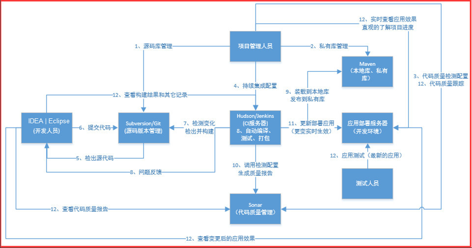

# 搭建敏捷高效的可持续集成管理平台

源码版本管理：Subversion、Git ...   
项目构建工具：Maven、Ant ...   
代码质量管理：Sonar、（Checkstyle、PMD、FindBugs...）   
持续集成引擎：Hudson、Jenlins、Apache Continuum     
应用持续部署：操作系统、JDK、Tomcat、JBoss ...   

## 持续集成管理平台的组成

## 使用IDEA 的sonarqube（插件：SonarLint）

1、在maven中配置sonar：打开setting.xml配置文件，在其中加入如下代码：

		   <profile>
		      <id>sonar</id>
		      <activation>
		        <activeByDefault>true</activeByDefault>
		      </activation>
		
		      <properties>
		        <sonar.jdbc.url>
		               jdbc:mysql://localhost:3306/sonar?useUnicode=true&characterEncoding=utf8
		        </sonar.jdbc.url>
		        <sonar.jdbc.driver>com.mysql.jdbc.Driver</sonar.jdbc.driver>
		        <sonar.jdbc.username>sonar</sonar.jdbc.username>
		        <sonar.jdbc.password>sonar</sonar.jdbc.password>
		        <sonar.host.url>http://localhost:9000</sonar.host.url>
		      </properties>
		    </profile>

1、打开要进行代码分析的项目根目录，新建sonar-project.properties文件

		# must be unique in a given SonarQube instance
		sonar.projectKey=my:project
		# this is the name displayed in the SonarQube UI
		sonar.projectName=apiautocore
		sonar.projectVersion=1.0
		
		# Path is relative to the sonar-project.properties file. Replace "\" by "/" on Windows.
		# Since SonarQube 4.2, this property is optional if sonar.modules is set.
		# If not set, SonarQube starts looking for source code from the directory containing
		# the sonar-project.properties file.
		sonar.sources=src
		
		# Encoding of the source code. Default is default system encoding
		#sonar.sourceEncoding=UTF-8
 
 其中：projectName是项目名字，sources是源文件所在的目录

2、在cmd进入项目所在的根目录，输入命令：sonar-runner，分析成功后会出现下图

